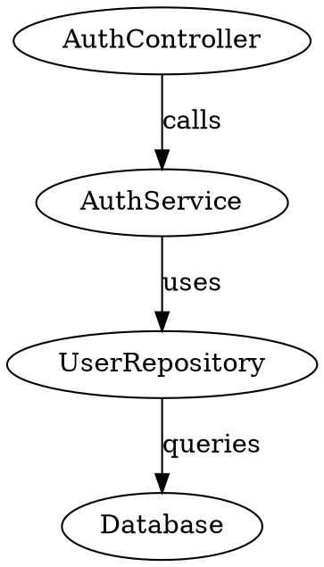

# MCP Graph Engine - Design Document

## Executive Summary

This document outlines the design for an MCP (Model Context Protocol) server that provides LLMs with a graph-based memory and reasoning tool. The server enables LLMs to build, query, and analyze relationship graphs during complex tasks like codebase exploration or research.

---

## Part 1: The Problem

### 1.1 Why LLMs Need Structured Relationship Memory

When LLMs work on complex tasks, they gather information incrementally across many interactions. Consider these scenarios:

**Codebase Exploration:**
- An LLM discovers that `AuthService` depends on `UserRepository`
- Later, it finds `UserRepository` uses `DatabasePool`
- Even later, it learns `DatabasePool` is configured by `ConfigLoader`
- Without structure, the LLM must hold these relationships in its context window, competing with other information

**Research Tasks:**
- An LLM finds that Concept A relates to Concept B
- It discovers B is a prerequisite for C
- It learns C contradicts D, which was mentioned earlier
- The web of relationships becomes difficult to reason about holistically

**The Core Problem:** LLMs have excellent pattern recognition and language understanding, but they lack persistent, queryable structure for the relationships they discover. Context windows are finite, and natural language is an inefficient encoding for graph structures.

### 1.2 Current Workarounds and Their Limitations

| Approach | Limitation |
|----------|------------|
| Keep notes in text | Hard to query; no algorithmic analysis |
| Mental model in context | Consumes tokens; lost on context overflow |
| Write to files | No relationship queries; just storage |
| External databases | Overkill; require schema design |

### 1.3 What a Graph Engine Provides

A graph data structure is the natural representation for relationship information:

- **Nodes** represent entities (files, concepts, people, modules)
- **Edges** represent relationships (depends-on, relates-to, calls, imports)
- **Algorithms** answer questions humans find tedious:
  - "What's the shortest path from A to Z?" (dependency chains)
  - "What are the most connected nodes?" (central concepts)
  - "What clusters exist?" (module boundaries)
  - "If I remove X, what becomes disconnected?" (impact analysis)

---

## Part 2: The Vision

### 2.1 A Thinking Tool for LLMs

The MCP Graph Engine is not a database—it's a **thinking tool**. It should be:

1. **Transient**: Graphs live in memory for a session; no persistence complexity
2. **Disposable**: Create, use, discard—no schema migrations or cleanup
3. **Fast to build**: Adding a relationship should be as easy as saying it
4. **Queryable**: Ask questions that would be tedious to answer manually
5. **Multi-tenant**: Support multiple Claude Code instances simultaneously

### 2.2 Use Cases

#### Codebase Understanding
```
LLM explores a new codebase:
  → Adds nodes: "AuthController", "AuthService", "UserRepo", "Database"
  → Adds edges: imports, calls, instantiates
  → Queries: "What are the most central modules?" → PageRank
  → Queries: "What's the dependency path from Controller to Database?"
  → Queries: "What components form isolated clusters?"
```

#### Research Synthesis
```
LLM researches a technical topic:
  → Adds nodes: papers, concepts, authors, techniques
  → Adds edges: cites, contradicts, extends, authored-by
  → Queries: "What are the foundational papers?" → Low in-degree, high out-citations
  → Queries: "What concepts bridge two clusters?"
  → Queries: "What's the citation path between these papers?"
```

#### Debugging / Root Cause Analysis
```
LLM debugging an issue:
  → Adds nodes: symptoms, hypotheses, evidence, code locations
  → Adds edges: supports, contradicts, caused-by, located-in
  → Queries: "What hypothesis has most supporting evidence?"
  → Queries: "What's unexplained?" → Nodes with no incoming edges
```

---

## Part 3: The LLM-Friendly Interface Challenge

### 3.1 The ID Problem

Traditional graph APIs require explicit identifiers:

```python
# Traditional approach - requires tracking IDs
node_id_1 = graph.add_node("AuthService")  # Returns: "a1b2c3d4"
node_id_2 = graph.add_node("UserRepository")  # Returns: "e5f6g7h8"
graph.add_edge(node_id_1, node_id_2, "depends_on")  # Must remember IDs!
```

**Why this is problematic for LLMs:**
- LLMs must track arbitrary ID strings across conversation turns
- IDs compete for context window space
- Typos in IDs cause silent failures or errors
- IDs have no semantic meaning—"a1b2c3d4" tells the LLM nothing

### 3.2 The Fuzzy Matching Solution

Instead of IDs, we use **semantic matching** on node labels:

```python
# LLM-friendly approach - match by meaning
graph.add_node("AuthService", type="class")
graph.add_node("UserRepository", type="class")
graph.add_edge("AuthService", "UserRepository", "depends_on")  # Match by name!

# Fuzzy matching handles variations:
graph.add_edge("Auth Service", "User Repo", "calls")  # Still works!
graph.add_edge("the authentication service", "user repository", "uses")  # Still works!
```

**How fuzzy matching works:**
1. **Exact match first**: If "AuthService" exists, use it
2. **Normalized match**: Case-insensitive, whitespace-normalized
3. **Embedding similarity**: Use sentence embeddings to find semantically similar nodes
4. **Threshold-based**: Only match if similarity > configurable threshold (e.g., 0.85)
5. **Disambiguation**: If multiple matches, return candidates for LLM to choose

**Benefits:**
- LLMs reference nodes naturally, as they would in conversation
- No ID tracking overhead
- Robust to minor variations in naming
- Semantic understanding of "the same thing"

### 3.3 Handling Ambiguity

When fuzzy matching finds multiple candidates:

```
LLM: add_edge("Service", "Database", "connects_to")

Response: {
  "status": "ambiguous",
  "source_candidates": [
    {"label": "AuthService", "similarity": 0.82},
    {"label": "PaymentService", "similarity": 0.81},
    {"label": "EmailService", "similarity": 0.79}
  ],
  "message": "Multiple nodes match 'Service'. Please be more specific."
}
```

The LLM can then refine: `add_edge("AuthService", "Database", "connects_to")`

---

## Part 4: Architecture

### 4.1 High-Level Architecture

```
┌─────────────────────────────────────────────────────────────────┐
│                      Claude Code Instance(s)                     │
└─────────────────────────────────────────────────────────────────┘
                                │
                                │ MCP Protocol (stdio)
                                ▼
┌─────────────────────────────────────────────────────────────────┐
│                       MCP Graph Server                           │
│  ┌───────────────────────────────────────────────────────────┐  │
│  │                    Session Manager                         │  │
│  │   • Named graph sessions (human-readable)                 │  │
│  │   • Default graph for simple use cases                    │  │
│  │   • Multi-tenant isolation                                │  │
│  │   • Auto-cleanup on idle timeout                          │  │
│  └───────────────────────────────────────────────────────────┘  │
│  ┌───────────────────────────────────────────────────────────┐  │
│  │                    Fuzzy Matcher                          │  │
│  │   • Exact matching                                        │  │
│  │   • Normalized matching                                   │  │
│  │   • Embedding-based semantic similarity                   │  │
│  └───────────────────────────────────────────────────────────┘  │
│  ┌───────────────────────────────────────────────────────────┐  │
│  │                    Graph Engine (NetworkX)                │  │
│  │   • Node/edge CRUD                                        │  │
│  │   • Path algorithms                                       │  │
│  │   • Centrality measures                                   │  │
│  │   • Component analysis                                    │  │
│  └───────────────────────────────────────────────────────────┘  │
│  ┌───────────────────────────────────────────────────────────┐  │
│  │                    Import/Export                          │  │
│  │   • DOT format parsing                                    │  │
│  │   • CSV/TSV edge lists                                    │  │
│  │   • GraphML, JSON                                         │  │
│  └───────────────────────────────────────────────────────────┘  │
└─────────────────────────────────────────────────────────────────┘
```

### 4.2 Why NetworkX

NetworkX is the ideal choice for this use case:

| Capability | NetworkX |
|------------|----------|
| Shortest path | Excellent (Dijkstra, A*, BFS) |
| PageRank | Built-in |
| Add/remove nodes | Simple, Pythonic API |
| DOT file support | Via pydot |
| Transitive reduction | Built-in |
| Connected components | Built-in |
| Cycle detection | Built-in |
| Memory efficiency | Good for graphs up to ~100K nodes |
| Dependencies | Pure Python, minimal deps |

For the typical LLM use case (graphs with tens to hundreds of nodes), NetworkX is fast, simple, and covers all needed algorithms.

### 4.3 Session Management (LLM-Friendly Design)

**The Problem with Opaque Session IDs:**

MCP does not expose a Claude Code session identifier to servers. If we use opaque IDs like `sess_a1b2c3d4`, the LLM must remember this ID across conversation turns. When context compacts (summarization), the ID could be lost.

**Solution: Named Sessions with Defaults**

```
┌─────────────────────────────────────────────────────────────────┐
│                    Session Lookup Strategy                       │
│                                                                  │
│  1. If graph_name provided → use that named graph               │
│  2. If graph_name omitted  → use "default" graph                │
│  3. Named graphs use human-readable names: "codebase", "research"│
│  4. list_graphs tool allows rediscovery if LLM forgets          │
└─────────────────────────────────────────────────────────────────┘
```

**How it works:**

```python
# Simple case: no graph name needed
add_node({ label: "AuthService" })  # Uses "default" graph

# Multiple graphs: use memorable names
add_node({ graph: "codebase", label: "AuthService" })
add_node({ graph: "research", label: "Paper A" })

# Forgot what graphs exist? Just ask!
list_graphs()  # Returns: ["default", "codebase", "research"]
```

**Benefits:**
- **Zero overhead for simple cases**: No session management needed
- **Human-readable names**: "codebase" is memorable, "sess_a1b2c3d4" is not
- **Recoverable**: LLM can always call `list_graphs()` to rediscover
- **Natural language friendly**: "Add this to the codebase graph"

**Session Storage:**

```python
graphs = {
    "default": {
        "graph": nx.DiGraph(),
        "embeddings": {},  # label -> embedding vector
        "created_at": timestamp,
        "last_accessed": timestamp,
    },
    "codebase": {
        "graph": nx.DiGraph(),
        "embeddings": {},
        ...
    }
}
```

**Session Lifecycle:**
1. First operation on a graph name → auto-creates the graph
2. `delete_graph(name)` → explicit cleanup
3. Auto-cleanup after configurable idle timeout (e.g., 2 hours)
4. Server restart → all graphs lost (transient by design)

---

## Part 5: MCP Tool Interface

### 5.1 Core Tools

#### Graph Management

```
list_graphs
  Input:  {}
  Output: { graphs: [{ name, node_count, edge_count, created_at }] }
  Notes:  Always available for LLM to rediscover graphs

delete_graph
  Input:  { graph?: string }
  Output: { success: boolean }
  Notes:  Defaults to "default" if not specified

get_graph_info
  Input:  { graph?: string }
  Output: {
    name: string,
    node_count: number,
    edge_count: number,
    is_directed: boolean,
    density: number,
    is_connected: boolean,
    is_dag: boolean,
    node_types: { type: count },
    relation_types: { relation: count }
  }
```

#### Node Operations

```
add_node
  Input:  { graph?: string, label: string, type?: string, properties?: object }
  Output: { node: { label, type, properties }, created: boolean }
  Notes:  Creates graph if doesn't exist; returns created=false if node existed

add_nodes
  Input:  { graph?: string, nodes: [{ label, type?, properties? }] }
  Output: { added: number, existing: number }

find_node
  Input:  { graph?: string, query: string }
  Output: { matches: [{ label, similarity, type, properties }] }
  Notes:  Uses fuzzy matching; returns top candidates

remove_node
  Input:  { graph?: string, label: string }
  Output: { success: boolean, edges_removed: number }

list_nodes
  Input:  { graph?: string, type?: string, limit?: number }
  Output: { nodes: [{ label, type, properties }] }
```

#### Edge Operations

```
add_edge
  Input:  { graph?: string, source: string, target: string, relation: string, properties?: object }
  Output: { edge: { source, target, relation }, created: boolean, source_matched: string, target_matched: string }
  Notes:  source/target are fuzzy-matched; response shows what was matched

add_edges
  Input:  { graph?: string, edges: [{ source, target, relation, properties? }] }
  Output: { added: number, failed: [{ edge, reason }] }

find_edges
  Input:  { graph?: string, source?: string, target?: string, relation?: string }
  Output: { edges: [{ source, target, relation, properties }] }

remove_edge
  Input:  { graph?: string, source: string, target: string, relation?: string }
  Output: { success: boolean }
```

#### Query & Analysis

```
get_neighbors
  Input:  { graph?: string, node: string, direction?: "in"|"out"|"both", relation?: string }
  Output: { neighbors: [{ label, relation, direction }] }

shortest_path
  Input:  { graph?: string, source: string, target: string }
  Output: { path: [string], length: number } | { path: null, reason: string }

all_paths
  Input:  { graph?: string, source: string, target: string, max_length?: number }
  Output: { paths: [[string]], count: number }

pagerank
  Input:  { graph?: string, top_n?: number }
  Output: { rankings: [{ label, score }] }

connected_components
  Input:  { graph?: string }
  Output: { components: [[string]], count: number }

find_cycles
  Input:  { graph?: string }
  Output: { cycles: [[string]], has_cycles: boolean }

transitive_reduction
  Input:  { graph?: string, in_place?: boolean }
  Output: { edges_removed: number }

degree_centrality
  Input:  { graph?: string, top_n?: number }
  Output: { rankings: [{ label, in_degree, out_degree, total }] }

subgraph
  Input:  { graph?: string, nodes: [string], include_edges?: boolean }
  Output: { nodes: [...], edges: [...] }
```

#### Import/Export

```
import_graph
  Input:  { graph?: string, format: "dot"|"csv"|"graphml"|"json", content: string }
  Output: { nodes_added: number, edges_added: number }
  Notes:  Merges into existing graph; creates graph if doesn't exist

export_graph
  Input:  { graph?: string, format: "dot"|"csv"|"graphml"|"json" }
  Output: { content: string }
```

### 5.2 Design Principles for Tools

1. **Optional graph parameter**: Defaults to "default" graph
2. **Fuzzy inputs**: Match nodes by semantic similarity when exact match fails
3. **Rich outputs**: Show what was actually matched/created
4. **Batch operations**: Support adding multiple nodes/edges in one call
5. **Self-documenting errors**: Errors explain what went wrong and suggest fixes
6. **Idempotent where sensible**: Adding existing node returns it, doesn't error

---

## Part 6: Fuzzy Matching Implementation

### 6.1 Matching Pipeline

```
Input: "auth service"
         │
         ▼
┌─────────────────────┐
│  1. Exact Match     │ → "auth service" exists? → Return it
└─────────────────────┘
         │ No
         ▼
┌─────────────────────┐
│  2. Normalized      │ → Lowercase, strip whitespace, remove punctuation
│     Match           │ → "authservice" matches "AuthService"? → Return it
└─────────────────────┘
         │ No
         ▼
┌─────────────────────┐
│  3. Embedding       │ → Compute sentence embedding for query
│     Similarity      │ → Find top-k nodes with similarity > threshold
└─────────────────────┘
         │
         ▼
┌─────────────────────┐
│  4. Return          │ → Single match above threshold: use it
│     Results         │ → Multiple matches: return candidates
│                     │ → No matches: create new node (if adding)
└─────────────────────┘
```

### 6.2 Local Embedding Model

We use a lightweight local embedding model for semantic matching:

**Model: `all-MiniLM-L6-v2`** (via sentence-transformers)
- ~80MB model size
- 384-dimensional embeddings
- Fast inference (~5ms per embedding on CPU)
- Good semantic understanding for short labels
- Runs entirely locally—no API calls

**How embeddings are used:**

```python
# When a node is added:
embedding = model.encode("AuthService")
graph_session["embeddings"]["AuthService"] = embedding

# When fuzzy matching:
query_embedding = model.encode("auth service")
for label, node_embedding in embeddings.items():
    similarity = cosine_similarity(query_embedding, node_embedding)
    if similarity > threshold:
        candidates.append((label, similarity))
```

**Embedding Cache:**
- Embeddings are computed once per node label and cached
- Cache is stored per-graph session
- No persistence needed (transient with session)

### 6.3 Configuration

```python
MATCHING_CONFIG = {
    "similarity_threshold": 0.75,    # Minimum similarity for auto-match
    "ambiguity_threshold": 0.05,     # If top matches within this range, return candidates
    "max_candidates": 5,             # Max candidates to return when ambiguous
    "embedding_model": "all-MiniLM-L6-v2",
}
```

### 6.4 Matching Behavior by Operation

| Operation | Exact Match | Fuzzy Match | No Match |
|-----------|-------------|-------------|----------|
| add_node | Return existing | Return existing | Create new |
| add_edge | Use matched | Use matched | Error (nodes must exist) |
| find_node | Return it | Return candidates | Empty result |
| remove_node | Remove it | Error (be specific) | Error (not found) |

---

## Part 7: Graph Format Import

### 7.1 Supported Formats

LLMs often know standard graph formats. Supporting import allows:
- LLM generates a DOT file from its understanding
- Sends the file content to MCP
- Graph is created instantly

#### DOT Format (GraphViz)


#### CSV Edge List
```csv
source,target,relation
AuthController,AuthService,calls
AuthService,UserRepository,uses
UserRepository,Database,queries
```

#### JSON Format
```json
{
  "nodes": [
    {"label": "AuthController", "type": "controller"},
    {"label": "AuthService", "type": "service"}
  ],
  "edges": [
    {"source": "AuthController", "target": "AuthService", "relation": "calls"}
  ]
}
```

### 7.2 Import Benefits

1. **Leverage LLM knowledge**: LLMs know DOT syntax, can generate valid graphs
2. **Bulk creation**: Add entire graph structures in one call
3. **Interoperability**: Import from other tools
4. **Visualization**: Export to DOT, render with GraphViz

---

## Part 8: Implementation Plan

### Phase 1: Core Foundation
- [ ] Project setup (Python, MCP SDK, dependencies)
- [ ] NetworkX integration with DiGraph
- [ ] Session manager with named graphs
- [ ] Basic CRUD operations (add/remove nodes/edges)
- [ ] Exact and normalized matching

### Phase 2: Fuzzy Matching
- [ ] Integrate sentence-transformers
- [ ] Embedding computation and caching
- [ ] Similarity search implementation
- [ ] Ambiguity detection and candidate return

### Phase 3: Query & Analysis
- [ ] Shortest path, all paths
- [ ] PageRank, degree centrality
- [ ] Connected components
- [ ] Cycle detection
- [ ] Transitive reduction
- [ ] Graph info/summary statistics

### Phase 4: Import/Export
- [ ] DOT format (via pydot)
- [ ] CSV edge list
- [ ] JSON format
- [ ] GraphML (via NetworkX)

### Phase 5: Polish
- [ ] Error messages optimized for LLM understanding
- [ ] Performance optimization for larger graphs
- [ ] Idle session cleanup
- [ ] Comprehensive testing

---

## Part 9: Example Interactions

### Example 1: Simple Use (Default Graph)

```
User: "Help me understand the authentication flow"

LLM: [explores files, discovers relationships]

LLM → MCP: add_nodes({
  nodes: [
    { label: "LoginController", type: "controller" },
    { label: "AuthService", type: "service" },
    { label: "UserRepository", type: "repository" },
    { label: "PostgresDB", type: "database" }
  ]
})
MCP → LLM: { added: 4, existing: 0 }

LLM → MCP: add_edges({
  edges: [
    { source: "LoginController", target: "AuthService", relation: "calls" },
    { source: "AuthService", target: "UserRepository", relation: "queries" },
    { source: "UserRepository", target: "PostgresDB", relation: "connects" }
  ]
})
MCP → LLM: { added: 3, failed: [] }

LLM → MCP: shortest_path({ source: "LoginController", target: "PostgresDB" })
MCP → LLM: { path: ["LoginController", "AuthService", "UserRepository", "PostgresDB"], length: 3 }

LLM to User: "The authentication flow goes: LoginController → AuthService →
UserRepository → PostgresDB. Three layers of abstraction."
```

### Example 2: Named Graphs

```
LLM → MCP: add_node({ graph: "before_refactor", label: "MonolithService" })
LLM → MCP: add_node({ graph: "after_refactor", label: "AuthService" })
LLM → MCP: add_node({ graph: "after_refactor", label: "UserService" })

LLM → MCP: list_graphs()
MCP → LLM: {
  graphs: [
    { name: "before_refactor", node_count: 1, edge_count: 0 },
    { name: "after_refactor", node_count: 2, edge_count: 0 }
  ]
}
```

### Example 3: Fuzzy Matching in Action

```
LLM → MCP: add_edge({
  source: "auth service",        // Fuzzy: matches "AuthService"
  target: "user repo",           // Fuzzy: matches "UserRepository"
  relation: "validates_with"
})
MCP → LLM: {
  edge: { source: "AuthService", target: "UserRepository", relation: "validates_with" },
  created: true,
  source_matched: "AuthService",   // Shows what was matched
  target_matched: "UserRepository"
}
```

### Example 4: Recovering from Context Loss

```
[After context compaction, LLM forgot which graphs exist]

LLM → MCP: list_graphs()
MCP → LLM: {
  graphs: [
    { name: "default", node_count: 12, edge_count: 18 },
    { name: "codebase", node_count: 45, edge_count: 67 }
  ]
}

LLM: "I can see there's a 'codebase' graph with 45 nodes. Let me continue working with that."

LLM → MCP: pagerank({ graph: "codebase", top_n: 5 })
```

### Example 5: DOT Import

```
LLM → MCP: import_graph({
  graph: "modules",
  format: "dot",
  content: `
    digraph {
      api -> auth;
      api -> users;
      auth -> database;
      users -> database;
    }
  `
})
MCP → LLM: { nodes_added: 4, edges_added: 4 }

LLM → MCP: pagerank({ graph: "modules", top_n: 3 })
MCP → LLM: {
  rankings: [
    { label: "database", score: 0.31 },
    { label: "api", score: 0.18 },
    { label: "auth", score: 0.14 }
  ]
}
```

---

## Part 10: Technical Decisions Summary

| Decision | Choice | Rationale |
|----------|--------|-----------|
| Graph library | NetworkX | Simple API, comprehensive algorithms, pure Python |
| Node matching | Fuzzy with embeddings | LLM-friendly; no ID tracking needed |
| Embedding model | all-MiniLM-L6-v2 | Small (~80MB), fast, good quality, local |
| Session identification | Named strings | Human-readable, recoverable via list_graphs |
| Default graph | "default" | Zero-config for simple use cases |
| Graph storage | In-memory dict | Transient by design; simplicity |
| MCP transport | stdio | Standard for Claude Code |
| Graph type | Directed (DiGraph) | Most LLM use cases involve directed relationships |

---

## Part 11: Dependencies

```
# Core
mcp                     # MCP Python SDK
networkx               # Graph algorithms

# Fuzzy matching
sentence-transformers  # Local embedding model
numpy                  # Embedding operations

# Import/Export
pydot                  # DOT format support

# Optional
graphviz               # For rendering (if visualization needed)
```

---

## Part 12: Open Questions

1. **Undirected graphs**: Should we support both directed and undirected? (Current: directed only)
2. **Weighted edges**: Should edge weights be first-class? (Current: via properties)
3. **Persistence**: Should we offer optional save/load? (Current: transient only)
4. **Visualization**: Should we return ASCII art or SVG for small graphs?
5. **Multi-graph queries**: Should we support queries across multiple graphs?

---

## Conclusion

The MCP Graph Engine provides LLMs with a structured thinking tool for relationship data. Key design decisions:

1. **Named graphs instead of opaque IDs** - LLMs can use memorable names and rediscover via `list_graphs()`
2. **Fuzzy matching with local embeddings** - No need to track exact node names
3. **Default graph for simplicity** - Zero configuration for simple use cases
4. **NetworkX for reliability** - Well-tested, comprehensive algorithm support

The design prioritizes LLM-friendliness over raw features. Every decision asks: "Will this be natural for an LLM to use?"
