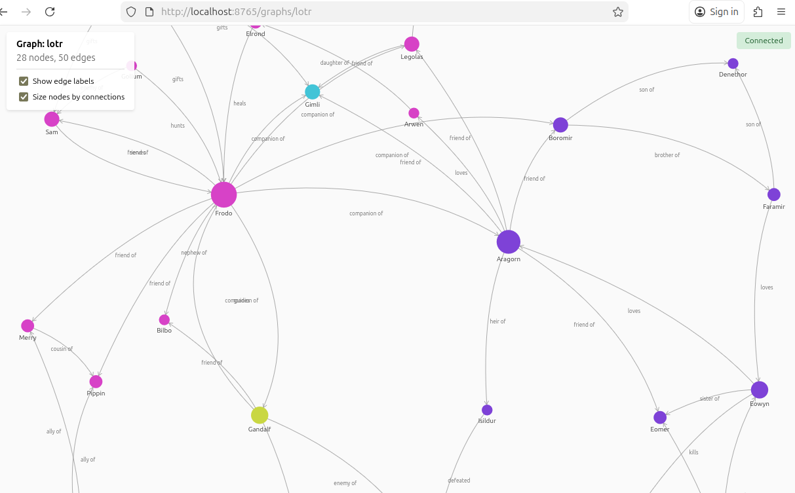

# MCP Graph Engine

A graph database for AI assistants via the Model Context Protocol. Build relationship graphs, run analysis algorithms, and visualize in real-time.



## Installation

**Requirements:** Python 3.10+, MCP-compatible client (Claude Code, Claude Desktop, Cursor)

```bash
pipx install mcp-graph-engine
```

Add to your MCP config:

```json
{
  "mcpServers": {
    "graph-engine": {
      "command": "mcp-graph-engine"
    }
  }
}
```

| Client | Config Location |
|--------|-----------------|
| Claude Code | `~/.mcp.json` or `.mcp.json` |
| Claude Desktop | `~/Library/Application Support/Claude/claude_desktop_config.json` |
| Cursor | `.cursor/mcp.json` |

Restart your client after adding the config.

## What You Can Do

Just ask your AI assistant:

- "Map out the dependencies in this codebase"
- "Build a graph of the characters in this document"
- "What's the most critical component?"
- "Are there any circular dependencies?"
- "Show me the path from X to Y"
- "Visualize the graph"

The AI handles the tool calls. You get a live visualization at `http://localhost:8765`.

## Features

- **Analysis** - PageRank, cycle detection, shortest paths, connected components
- **Visualization** - Live D3 force-directed graph in your browser
- **Import/Export** - DOT, CSV, GraphML, JSON, Mermaid

## Configuration

| Variable | Default | Description |
|----------|---------|-------------|
| `VIS_PORT` | `8765` | Visualization server port |
| `VIS_HOST` | `localhost` | Visualization server host |
| `VIS_ENABLED` | `true` | Enable/disable visualization |

## Notes

- **Transient** - Graphs live in memory. Export to JSON for persistence.
- **Fuzzy matching** - `pipx install mcp-graph-engine[embeddings]` for semantic node matching.

## License

MIT
