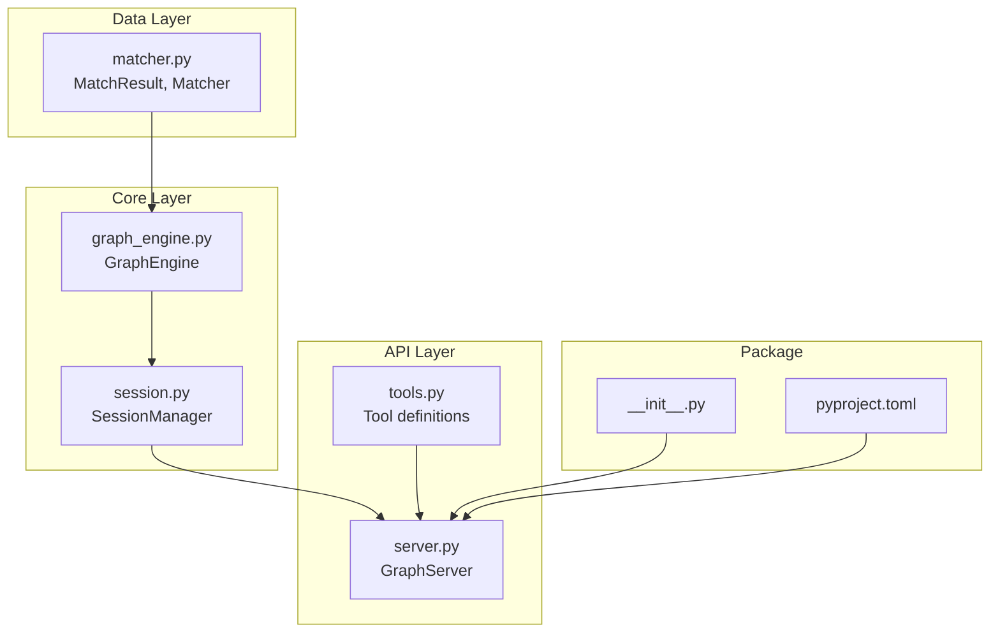

# Human Replay Guide: MCP Graph Engine

> Optimal path from vibe session, not the exploration journey.

## Overview

- **Built**: An MCP server providing LLMs with a graph-based memory and reasoning tool. Supports named graph sessions, 3-tier fuzzy node matching (exact, normalized, embedding-based), 23 MCP tools, and 4 import/export formats.
- **Key decisions**:
  - DiGraph (single edge per node pair) over MultiDiGraph for simplicity
  - Lazy-loaded sentence-transformers to avoid startup overhead
  - Named graphs with "default" fallback for zero-config usage
  - NetworkX for battle-tested graph algorithms
- **Files affected**: 10 source files, 3 test files
- **Base commit**: `f90e6bd` (initial commit with DESIGN.md)
- **Final commit**: `a3f234d` (Phase 5 complete)

## Dependency Graph



---

## Phase 1: Project Foundation

**Layer**: Infrastructure + Data Models
**Domain**: Backend API / CLI Tools
**Prerequisites**: None

This phase establishes the project structure and implements the core CRUD operations without fuzzy matching.

---

### Step 1.1: Create Project Structure

**Files**: `pyproject.toml`, `src/mcp_graph_engine/__init__.py`
**Action**: Create

**Context**: Python packaging using modern pyproject.toml format. The package uses setuptools as the build backend and declares all required dependencies upfront.

**Target** (`pyproject.toml`):
```toml
[build-system]
requires = ["setuptools>=61.0", "wheel"]
build-backend = "setuptools.build_meta"

[project]
name = "mcp-graph-engine"
version = "0.1.0"
description = "MCP Graph Engine - A graph-based memory and reasoning tool for LLMs"
readme = "README.md"
requires-python = ">=3.9"
dependencies = [
    "mcp>=0.9.0",
    "networkx>=3.0",
    "sentence-transformers>=2.2.0",
    "numpy>=1.24.0",
    "pydot>=1.4.0",
]

[project.optional-dependencies]
dev = [
    "pytest>=7.0.0",
    "pytest-asyncio>=0.21.0",
]

[tool.setuptools.packages.find]
where = ["src"]

[project.scripts]
mcp-graph-engine = "mcp_graph_engine.server:main"

[tool.pytest.ini_options]
asyncio_mode = "auto"
asyncio_default_fixture_loop_scope = "function"
```

**Target** (`src/mcp_graph_engine/__init__.py`):
```python
"""MCP Graph Engine - A graph-based memory and reasoning tool for LLMs."""

__version__ = "0.1.0"
```

**Instructions**:
- [ ] Create `src/mcp_graph_engine/` directory structure
- [ ] Create the pyproject.toml with all dependencies declared upfront
- [ ] Create the package __init__.py
- [ ] Verify with `pip install -e .`

**Retrospective** *(pause and reflect before continuing)*:
- [ ] Why declare all dependencies (including sentence-transformers) upfront even though fuzzy matching comes in Phase 2? What are the tradeoffs of declaring vs. lazy dependency discovery?
- [ ] Why use `setuptools.build_meta` over alternatives like Poetry or Flit? When would you choose differently?
- [ ] The entry point `mcp-graph-engine = "mcp_graph_engine.server:main"` assumes a specific structure. What contract does this create?

---

### Step 1.2: Implement Basic Matcher

**File**: `src/mcp_graph_engine/matcher.py`
**Action**: Create

**Context**: The Matcher handles node label lookup. In Phase 1, we only implement exact and normalized matching. The embedding-based matching will be added in Phase 2. The design allows the Matcher to be extended without modifying callers.

**Target**:
```python
"""Node matching logic with exact, normalized, and embedding-based matching."""

import re
from typing import Optional, List, Tuple, Dict
import numpy as np


# Matching configuration constants
MATCHING_CONFIG = {
    "similarity_threshold": 0.75,    # Minimum similarity for auto-match
    "ambiguity_threshold": 0.05,     # If top matches within this range, return candidates
    "max_candidates": 5,             # Max candidates to return when ambiguous
    "embedding_model": "all-MiniLM-L6-v2",
}


class MatchResult:
    """Result of a node matching operation."""

    def __init__(
        self,
        matched_label: Optional[str],
        exact: bool = False,
        similarity: float = 1.0,
        candidates: Optional[List[Tuple[str, float]]] = None
    ):
        self.matched_label = matched_label
        self.exact = exact
        self.similarity = similarity
        self.candidates = candidates or []


class Matcher:
    """Handles node matching with exact, normalized, and embedding-based strategies."""

    def __init__(self, embeddings: Optional[Dict[str, np.ndarray]] = None):
        """
        Initialize the matcher.

        Args:
            embeddings: Optional dict mapping node labels to embedding vectors
        """
        self.embeddings = embeddings or {}
        self._model = None  # Lazy-loaded sentence transformer model

    def find_match(self, query: str, existing_labels: List[str]) -> MatchResult:
        """
        Find a matching node label using exact, normalized, and embedding-based matching.

        Args:
            query: The query string to match
            existing_labels: List of existing node labels in the graph

        Returns:
            MatchResult with matched_label (or None if no match)
        """
        # Step 1: Exact match
        if query in existing_labels:
            return MatchResult(matched_label=query, exact=True, similarity=1.0)

        # Step 2: Normalized match
        normalized_query = self._normalize(query)

        for label in existing_labels:
            normalized_label = self._normalize(label)
            if normalized_query == normalized_label:
                return MatchResult(matched_label=label, exact=False, similarity=1.0)

        # Step 3: Embedding-based similarity matching (Phase 2)
        if self.embeddings:
            embedding_result = self._embedding_match(query, existing_labels)
            if embedding_result:
                return embedding_result

        # No match found
        return MatchResult(matched_label=None, similarity=0.0)

    def _embedding_match(self, query: str, existing_labels: List[str]) -> Optional[MatchResult]:
        """Placeholder for Phase 2 embedding matching."""
        return None  # Will be implemented in Phase 2

    def _normalize(self, text: str) -> str:
        """
        Normalize text for matching: lowercase, strip whitespace, remove punctuation.

        Args:
            text: Text to normalize

        Returns:
            Normalized text
        """
        # Convert to lowercase
        text = text.lower()
        # Strip leading/trailing whitespace
        text = text.strip()
        # Remove punctuation (keep only alphanumeric and spaces)
        text = re.sub(r'[^a-z0-9\s]', '', text)
        # Collapse multiple spaces to single space
        text = re.sub(r'\s+', ' ', text)
        # Remove remaining spaces for final comparison
        text = text.replace(' ', '')

        return text
```

**Instructions**:
- [ ] Create the matcher.py file with the MatchResult and Matcher classes
- [ ] Note that `_embedding_match` returns None for now (stub for Phase 2)
- [ ] The config constants are defined upfront for Phase 2

**Retrospective** *(pause and reflect before continuing)*:
- [ ] The `_normalize()` method removes all spaces after processing. What edge cases might this create? (Hint: "Database" vs "Data Base")
- [ ] Why return a `MatchResult` object rather than just the matched string? What future flexibility does this provide?
- [ ] The matching order (exact -> normalized -> embedding) is deliberate. Why not try embedding first since it is the most flexible?

---

### Step 1.3: Implement GraphEngine Core

**File**: `src/mcp_graph_engine/graph_engine.py`
**Action**: Create

**Context**: The GraphEngine wraps NetworkX's DiGraph with higher-level operations. It owns the Matcher and manages embeddings. This is the core business logic layer.

**Target** (Phase 1 subset - CRUD only, ~400 lines):
```python
"""Graph engine wrapping NetworkX with high-level operations."""

from typing import List, Dict, Any, Optional, Tuple
import networkx as nx
import numpy as np
from .matcher import Matcher, MatchResult


class GraphEngine:
    """Wrapper around NetworkX DiGraph with MCP-friendly operations."""

    def __init__(self, embeddings: Optional[Dict[str, np.ndarray]] = None):
        """
        Initialize the graph engine.

        Args:
            embeddings: Optional dict mapping node labels to embedding vectors
        """
        self.graph = nx.DiGraph()
        self.embeddings = embeddings if embeddings is not None else {}
        self.matcher = Matcher(self.embeddings)
        self._embedding_model = None  # Lazy-loaded

    def add_node(
        self, label: str, node_type: Optional[str] = None, properties: Optional[Dict[str, Any]] = None
    ) -> Tuple[Dict[str, Any], bool]:
        """
        Add a node to the graph.

        Args:
            label: Node label
            node_type: Optional node type
            properties: Optional node properties

        Returns:
            Tuple of (node_data, created) where created is True if node was newly created
        """
        created = label not in self.graph

        # Prepare node attributes
        attrs = {}
        if node_type:
            attrs['type'] = node_type
        if properties:
            attrs.update(properties)

        self.graph.add_node(label, **attrs)

        # Compute and cache embedding for new nodes (Phase 2)
        if created and label not in self.embeddings:
            self._compute_embedding(label)

        # Return node data
        node_data = {
            'label': label,
            'type': node_type,
            'properties': properties or {}
        }

        return node_data, created

    def _compute_embedding(self, label: str):
        """Placeholder for Phase 2 embedding computation."""
        pass  # Will be implemented in Phase 2

    def add_nodes(self, nodes: List[Dict[str, Any]]) -> Tuple[int, int]:
        """
        Add multiple nodes to the graph.

        Args:
            nodes: List of node dicts with 'label', optional 'type', optional 'properties'

        Returns:
            Tuple of (added_count, existing_count)
        """
        added = 0
        existing = 0

        for node in nodes:
            label = node['label']
            node_type = node.get('type')
            properties = node.get('properties')

            _, created = self.add_node(label, node_type, properties)

            if created:
                added += 1
            else:
                existing += 1

        return added, existing

    def remove_node(self, label: str) -> Tuple[bool, int]:
        """
        Remove a node from the graph.

        Args:
            label: Node label to remove

        Returns:
            Tuple of (success, edges_removed)
        """
        if label not in self.graph:
            return False, 0

        # Count edges that will be removed
        edges_removed = self.graph.in_degree(label) + self.graph.out_degree(label)

        self.graph.remove_node(label)

        return True, edges_removed

    def list_nodes(
        self, type_filter: Optional[str] = None, limit: Optional[int] = None
    ) -> List[Dict[str, Any]]:
        """
        List nodes in the graph.

        Args:
            type_filter: Optional type to filter by
            limit: Optional limit on number of nodes returned

        Returns:
            List of node dicts with label, type, and properties
        """
        nodes = []

        for label, attrs in self.graph.nodes(data=True):
            node_type = attrs.get('type')

            # Apply type filter
            if type_filter and node_type != type_filter:
                continue

            # Build properties dict (everything except 'type')
            properties = {k: v for k, v in attrs.items() if k != 'type'}

            nodes.append({
                'label': label,
                'type': node_type,
                'properties': properties
            })

            # Apply limit
            if limit and len(nodes) >= limit:
                break

        return nodes

    def find_node(self, query: str) -> Dict[str, Any]:
        """
        Find nodes matching the query using fuzzy matching.

        Args:
            query: Query string to match against node labels

        Returns:
            Dict with 'matches' list containing matching nodes with similarity scores
        """
        existing_labels = list(self.graph.nodes())
        match_result = self.matcher.find_match(query, existing_labels)

        matches = []

        # If we have candidates (ambiguous match), return all of them
        if match_result.candidates:
            for label, similarity in match_result.candidates:
                attrs = self.graph.nodes[label]
                node_type = attrs.get('type')
                properties = {k: v for k, v in attrs.items() if k != 'type'}

                matches.append({
                    'label': label,
                    'similarity': similarity,
                    'type': node_type,
                    'properties': properties
                })

        # If we have a single match, return it
        elif match_result.matched_label:
            label = match_result.matched_label
            attrs = self.graph.nodes[label]
            node_type = attrs.get('type')
            properties = {k: v for k, v in attrs.items() if k != 'type'}

            matches.append({
                'label': label,
                'similarity': match_result.similarity,
                'type': node_type,
                'properties': properties
            })

        return {'matches': matches}

    def add_edge(
        self,
        source: str,
        target: str,
        relation: str,
        properties: Optional[Dict[str, Any]] = None
    ) -> Tuple[Dict[str, Any], bool, str, str]:
        """
        Add an edge to the graph with fuzzy matching for source and target.

        Args:
            source: Source node label (will be fuzzy matched)
            target: Target node label (will be fuzzy matched)
            relation: Edge relation type
            properties: Optional edge properties

        Returns:
            Tuple of (edge_data, created, source_matched, target_matched)

        Raises:
            ValueError: If source or target nodes don't exist (no match found)
        """
        # Match source node
        existing_nodes = list(self.graph.nodes())
        if not existing_nodes:
            raise ValueError(f"Cannot add edge: graph is empty. Add nodes first with add_node or add_nodes.")

        source_match = self.matcher.find_match(source, existing_nodes)
        if not source_match.matched_label:
            available = ", ".join(existing_nodes[:5])
            if len(existing_nodes) > 5:
                available += f", ... ({len(existing_nodes)} total nodes)"
            raise ValueError(f"Source node '{source}' not found. Available nodes: {available}. Use find_node to search.")

        # Match target node
        target_match = self.matcher.find_match(target, existing_nodes)
        if not target_match.matched_label:
            available = ", ".join(existing_nodes[:5])
            if len(existing_nodes) > 5:
                available += f", ... ({len(existing_nodes)} total nodes)"
            raise ValueError(f"Target node '{target}' not found. Available nodes: {available}. Use find_node to search.")

        source_matched = source_match.matched_label
        target_matched = target_match.matched_label

        # Check if edge already exists
        created = not self.graph.has_edge(source_matched, target_matched)

        # Prepare edge attributes
        attrs = {'relation': relation}
        if properties:
            attrs.update(properties)

        self.graph.add_edge(source_matched, target_matched, **attrs)

        edge_data = {
            'source': source_matched,
            'target': target_matched,
            'relation': relation
        }

        return edge_data, created, source_matched, target_matched

    def add_edges(self, edges: List[Dict[str, Any]]) -> Tuple[int, List[Dict[str, Any]]]:
        """
        Add multiple edges to the graph.

        Args:
            edges: List of edge dicts with 'source', 'target', 'relation', optional 'properties'

        Returns:
            Tuple of (added_count, failed_list)
        """
        added = 0
        failed = []

        for edge in edges:
            source = edge['source']
            target = edge['target']
            relation = edge['relation']
            properties = edge.get('properties')

            try:
                _, created, _, _ = self.add_edge(source, target, relation, properties)
                if created:
                    added += 1
            except ValueError as e:
                failed.append({
                    'edge': edge,
                    'reason': str(e)
                })

        return added, failed

    def remove_edge(
        self, source: str, target: str, relation: Optional[str] = None
    ) -> bool:
        """
        Remove an edge from the graph.

        Args:
            source: Source node label
            target: Target node label
            relation: Optional relation to match (if None, removes all edges between nodes)

        Returns:
            True if edge was removed, False otherwise
        """
        # Match source node
        source_match = self.matcher.find_match(source, list(self.graph.nodes()))
        if not source_match.matched_label:
            return False

        # Match target node
        target_match = self.matcher.find_match(target, list(self.graph.nodes()))
        if not target_match.matched_label:
            return False

        source_matched = source_match.matched_label
        target_matched = target_match.matched_label

        if not self.graph.has_edge(source_matched, target_matched):
            return False

        # If relation is specified, check if it matches
        if relation:
            edge_data = self.graph.get_edge_data(source_matched, target_matched)
            if edge_data.get('relation') != relation:
                return False

        self.graph.remove_edge(source_matched, target_matched)
        return True

    def find_edges(
        self,
        source: Optional[str] = None,
        target: Optional[str] = None,
        relation: Optional[str] = None
    ) -> List[Dict[str, Any]]:
        """
        Find edges matching the given criteria.

        Args:
            source: Optional source node label to filter by
            target: Optional target node label to filter by
            relation: Optional relation type to filter by

        Returns:
            List of edge dicts with source, target, relation, and properties
        """
        # Match source if provided
        source_matched = None
        if source:
            source_match = self.matcher.find_match(source, list(self.graph.nodes()))
            if source_match.matched_label:
                source_matched = source_match.matched_label

        # Match target if provided
        target_matched = None
        if target:
            target_match = self.matcher.find_match(target, list(self.graph.nodes()))
            if target_match.matched_label:
                target_matched = target_match.matched_label

        edges = []

        for src, tgt, attrs in self.graph.edges(data=True):
            # Apply filters
            if source_matched and src != source_matched:
                continue
            if target_matched and tgt != target_matched:
                continue
            if relation and attrs.get('relation') != relation:
                continue

            # Build properties dict (everything except 'relation')
            properties = {k: v for k, v in attrs.items() if k != 'relation'}

            edges.append({
                'source': src,
                'target': tgt,
                'relation': attrs.get('relation'),
                'properties': properties
            })

        return edges

    def get_neighbors(
        self,
        node: str,
        direction: str = "both",
        relation: Optional[str] = None
    ) -> List[Dict[str, Any]]:
        """
        Get neighbors of a node.

        Args:
            node: Node label
            direction: "in", "out", or "both"
            relation: Optional relation type to filter by

        Returns:
            List of neighbor dicts with label, relation, and direction
        """
        # Match node
        node_match = self.matcher.find_match(node, list(self.graph.nodes()))
        if not node_match.matched_label:
            return []

        node_matched = node_match.matched_label
        neighbors = []

        # Get incoming neighbors
        if direction in ("in", "both"):
            for pred in self.graph.predecessors(node_matched):
                edge_data = self.graph.get_edge_data(pred, node_matched)
                edge_relation = edge_data.get('relation')

                if relation and edge_relation != relation:
                    continue

                neighbors.append({
                    'label': pred,
                    'relation': edge_relation,
                    'direction': 'in'
                })

        # Get outgoing neighbors
        if direction in ("out", "both"):
            for succ in self.graph.successors(node_matched):
                edge_data = self.graph.get_edge_data(node_matched, succ)
                edge_relation = edge_data.get('relation')

                if relation and edge_relation != relation:
                    continue

                neighbors.append({
                    'label': succ,
                    'relation': edge_relation,
                    'direction': 'out'
                })

        return neighbors

    def get_stats(self) -> Dict[str, Any]:
        """
        Get graph statistics.

        Returns:
            Dict with node_count, edge_count, and other stats
        """
        node_count = self.graph.number_of_nodes()
        edge_count = self.graph.number_of_edges()

        # Count node types
        node_types = {}
        for _, attrs in self.graph.nodes(data=True):
            node_type = attrs.get('type', 'unknown')
            node_types[node_type] = node_types.get(node_type, 0) + 1

        # Count relation types
        relation_types = {}
        for _, _, attrs in self.graph.edges(data=True):
            relation = attrs.get('relation', 'unknown')
            relation_types[relation] = relation_types.get(relation, 0) + 1

        # Calculate density
        if node_count > 1:
            density = edge_count / (node_count * (node_count - 1))
        else:
            density = 0.0

        # Check if DAG
        is_dag = nx.is_directed_acyclic_graph(self.graph)

        # Check if connected (weakly for directed graph)
        is_connected = nx.is_weakly_connected(self.graph) if node_count > 0 else True

        return {
            'node_count': node_count,
            'edge_count': edge_count,
            'is_directed': True,
            'density': density,
            'is_connected': is_connected,
            'is_dag': is_dag,
            'node_types': node_types,
            'relation_types': relation_types
        }
```

**Instructions**:
- [ ] Create graph_engine.py with the GraphEngine class
- [ ] Note the `_compute_embedding` is a stub for Phase 2
- [ ] Study how `add_edge` uses the Matcher for fuzzy node lookup
- [ ] Understand the error message pattern with available options

**Retrospective** *(pause and reflect before continuing)*:
- [ ] The error messages in `add_edge` list available nodes. Why is this important for LLM consumers? What cognitive load does it reduce?
- [ ] Why use `DiGraph` (single edge per node pair) instead of `MultiDiGraph`? What real-world use cases does this decision exclude?
- [ ] The `get_stats()` method checks `is_weakly_connected` for directed graphs. Why weakly rather than strongly connected? What is the semantic difference?
- [ ] How does the embeddings dict get shared between GraphEngine and Matcher? Trace the reference chain.

---

### Step 1.4: Implement Session Manager

**File**: `src/mcp_graph_engine/session.py`
**Action**: Create

**Context**: The SessionManager provides named graph isolation. Each graph has its own embeddings dict and GraphEngine. The "default" graph enables zero-config usage.

**Target**:
```python
"""Session manager for named graphs."""

from typing import Dict, List, Any
from datetime import datetime
from .graph_engine import GraphEngine


class SessionManager:
    """Manages multiple named graph sessions."""

    def __init__(self):
        self.graphs: Dict[str, Dict[str, Any]] = {}

    def get_graph(self, name: str = "default") -> GraphEngine:
        """
        Get or create a graph session by name.

        Args:
            name: Graph name (defaults to "default")

        Returns:
            GraphEngine instance
        """
        if name not in self.graphs:
            # Create embeddings dict that will be shared between GraphEngine and its Matcher
            embeddings = {}

            # Auto-create graph on first access with shared embeddings
            self.graphs[name] = {
                'graph': GraphEngine(embeddings=embeddings),
                'embeddings': embeddings,  # Keep reference for potential future use
                'created_at': datetime.now(),
                'last_accessed': datetime.now()
            }

        # Update last accessed time
        self.graphs[name]['last_accessed'] = datetime.now()

        return self.graphs[name]['graph']

    def list_graphs(self) -> List[Dict[str, Any]]:
        """
        List all graph sessions.

        Returns:
            List of graph info dicts with name, node_count, edge_count, created_at
        """
        result = []

        for name, session in self.graphs.items():
            graph_engine = session['graph']
            stats = graph_engine.get_stats()

            result.append({
                'name': name,
                'node_count': stats['node_count'],
                'edge_count': stats['edge_count'],
                'created_at': session['created_at'].isoformat()
            })

        return result

    def delete_graph(self, name: str = "default") -> bool:
        """
        Delete a graph session.

        Args:
            name: Graph name to delete

        Returns:
            True if graph was deleted, False if it didn't exist
        """
        if name in self.graphs:
            del self.graphs[name]
            return True
        return False

    def get_graph_info(self, name: str = "default") -> Dict[str, Any]:
        """
        Get detailed information about a graph.

        Args:
            name: Graph name

        Returns:
            Dict with graph statistics and metadata

        Raises:
            ValueError: If graph doesn't exist
        """
        if name not in self.graphs:
            available = [g['name'] for g in self.list_graphs()]
            if available:
                available_str = ", ".join(available)
                raise ValueError(f"Graph '{name}' does not exist. Available graphs: {available_str}. Use list_graphs to see all.")
            else:
                raise ValueError(f"Graph '{name}' does not exist. No graphs have been created yet. Operations on a graph auto-create it.")

        session = self.graphs[name]
        graph_engine = session['graph']
        stats = graph_engine.get_stats()

        return {
            'name': name,
            'node_count': stats['node_count'],
            'edge_count': stats['edge_count'],
            'is_directed': stats['is_directed'],
            'density': stats['density'],
            'is_connected': stats['is_connected'],
            'is_dag': stats['is_dag'],
            'node_types': stats['node_types'],
            'relation_types': stats['relation_types'],
            'created_at': session['created_at'].isoformat(),
            'last_accessed': session['last_accessed'].isoformat()
        }
```

**Instructions**:
- [ ] Create session.py with the SessionManager class
- [ ] Note how embeddings dict is created externally and passed to GraphEngine
- [ ] Understand the auto-create-on-access pattern

**Retrospective** *(pause and reflect before continuing)*:
- [ ] The embeddings dict is created in SessionManager but owned by GraphEngine. Why this design? What would break if GraphEngine created its own?
- [ ] `get_graph()` auto-creates on first access, but `get_graph_info()` raises if graph does not exist. Why the asymmetry?
- [ ] What happens if two requests call `get_graph("mydata")` simultaneously? Is this thread-safe?

---

### Step 1.5: Define MCP Tools

**File**: `src/mcp_graph_engine/tools.py`
**Action**: Create

**Context**: MCP tools are defined as JSON Schema objects. Each tool has a name, description (shown to LLMs), and input schema. The descriptions should guide LLM usage.

**Target** (Phase 1 subset - 13 tools):
```python
"""MCP tool definitions for graph operations."""

from mcp.types import Tool


# Graph Management Tools

TOOL_LIST_GRAPHS = Tool(
    name="list_graphs",
    description="List all graph sessions with their basic statistics",
    inputSchema={
        "type": "object",
        "properties": {},
        "required": []
    }
)

TOOL_DELETE_GRAPH = Tool(
    name="delete_graph",
    description="Delete a graph session",
    inputSchema={
        "type": "object",
        "properties": {
            "graph": {
                "type": "string",
                "description": "Name of the graph to delete (defaults to 'default')"
            }
        },
        "required": []
    }
)

TOOL_GET_GRAPH_INFO = Tool(
    name="get_graph_info",
    description="Get detailed information and statistics about a graph",
    inputSchema={
        "type": "object",
        "properties": {
            "graph": {
                "type": "string",
                "description": "Name of the graph (defaults to 'default')"
            }
        },
        "required": []
    }
)

# Node Operation Tools

TOOL_ADD_NODE = Tool(
    name="add_node",
    description="Add a node to the graph. Returns created=false if node already exists.",
    inputSchema={
        "type": "object",
        "properties": {
            "graph": {
                "type": "string",
                "description": "Name of the graph (defaults to 'default')"
            },
            "label": {
                "type": "string",
                "description": "Node label (unique identifier)"
            },
            "type": {
                "type": "string",
                "description": "Node type (optional, e.g., 'class', 'function', 'concept')"
            },
            "properties": {
                "type": "object",
                "description": "Additional node properties (optional)"
            }
        },
        "required": ["label"]
    }
)

TOOL_ADD_NODES = Tool(
    name="add_nodes",
    description="Add multiple nodes to the graph in a batch operation",
    inputSchema={
        "type": "object",
        "properties": {
            "graph": {
                "type": "string",
                "description": "Name of the graph (defaults to 'default')"
            },
            "nodes": {
                "type": "array",
                "description": "List of nodes to add",
                "items": {
                    "type": "object",
                    "properties": {
                        "label": {"type": "string"},
                        "type": {"type": "string"},
                        "properties": {"type": "object"}
                    },
                    "required": ["label"]
                }
            }
        },
        "required": ["nodes"]
    }
)

TOOL_FIND_NODE = Tool(
    name="find_node",
    description="Find nodes matching a query using exact and normalized matching",
    inputSchema={
        "type": "object",
        "properties": {
            "graph": {
                "type": "string",
                "description": "Name of the graph (defaults to 'default')"
            },
            "query": {
                "type": "string",
                "description": "Query string to match against node labels"
            }
        },
        "required": ["query"]
    }
)

TOOL_REMOVE_NODE = Tool(
    name="remove_node",
    description="Remove a node from the graph (also removes all connected edges)",
    inputSchema={
        "type": "object",
        "properties": {
            "graph": {
                "type": "string",
                "description": "Name of the graph (defaults to 'default')"
            },
            "label": {
                "type": "string",
                "description": "Node label to remove"
            }
        },
        "required": ["label"]
    }
)

TOOL_LIST_NODES = Tool(
    name="list_nodes",
    description="List nodes in the graph, optionally filtered by type",
    inputSchema={
        "type": "object",
        "properties": {
            "graph": {
                "type": "string",
                "description": "Name of the graph (defaults to 'default')"
            },
            "type": {
                "type": "string",
                "description": "Filter by node type (optional)"
            },
            "limit": {
                "type": "number",
                "description": "Maximum number of nodes to return (optional)"
            }
        },
        "required": []
    }
)

# Edge Operation Tools

TOOL_ADD_EDGE = Tool(
    name="add_edge",
    description="Add an edge between two nodes. Source and target are fuzzy matched against existing nodes.",
    inputSchema={
        "type": "object",
        "properties": {
            "graph": {
                "type": "string",
                "description": "Name of the graph (defaults to 'default')"
            },
            "source": {
                "type": "string",
                "description": "Source node label (will be fuzzy matched)"
            },
            "target": {
                "type": "string",
                "description": "Target node label (will be fuzzy matched)"
            },
            "relation": {
                "type": "string",
                "description": "Relation type (e.g., 'depends_on', 'calls', 'relates_to')"
            },
            "properties": {
                "type": "object",
                "description": "Additional edge properties (optional)"
            }
        },
        "required": ["source", "target", "relation"]
    }
)

TOOL_ADD_EDGES = Tool(
    name="add_edges",
    description="Add multiple edges to the graph in a batch operation",
    inputSchema={
        "type": "object",
        "properties": {
            "graph": {
                "type": "string",
                "description": "Name of the graph (defaults to 'default')"
            },
            "edges": {
                "type": "array",
                "description": "List of edges to add",
                "items": {
                    "type": "object",
                    "properties": {
                        "source": {"type": "string"},
                        "target": {"type": "string"},
                        "relation": {"type": "string"},
                        "properties": {"type": "object"}
                    },
                    "required": ["source", "target", "relation"]
                }
            }
        },
        "required": ["edges"]
    }
)

TOOL_FIND_EDGES = Tool(
    name="find_edges",
    description="Find edges matching the given criteria (all parameters are optional filters)",
    inputSchema={
        "type": "object",
        "properties": {
            "graph": {
                "type": "string",
                "description": "Name of the graph (defaults to 'default')"
            },
            "source": {
                "type": "string",
                "description": "Source node label to filter by (optional)"
            },
            "target": {
                "type": "string",
                "description": "Target node label to filter by (optional)"
            },
            "relation": {
                "type": "string",
                "description": "Relation type to filter by (optional)"
            }
        },
        "required": []
    }
)

TOOL_REMOVE_EDGE = Tool(
    name="remove_edge",
    description="Remove an edge from the graph",
    inputSchema={
        "type": "object",
        "properties": {
            "graph": {
                "type": "string",
                "description": "Name of the graph (defaults to 'default')"
            },
            "source": {
                "type": "string",
                "description": "Source node label"
            },
            "target": {
                "type": "string",
                "description": "Target node label"
            },
            "relation": {
                "type": "string",
                "description": "Relation type to match (optional, removes all edges if omitted)"
            }
        },
        "required": ["source", "target"]
    }
)

TOOL_GET_NEIGHBORS = Tool(
    name="get_neighbors",
    description="Get neighbors of a node with optional direction and relation filtering",
    inputSchema={
        "type": "object",
        "properties": {
            "graph": {
                "type": "string",
                "description": "Name of the graph (defaults to 'default')"
            },
            "node": {
                "type": "string",
                "description": "Node label to get neighbors for"
            },
            "direction": {
                "type": "string",
                "enum": ["in", "out", "both"],
                "description": "Direction of edges to follow (defaults to 'both')"
            },
            "relation": {
                "type": "string",
                "description": "Relation type to filter by (optional)"
            }
        },
        "required": ["node"]
    }
)

# All tools list (Phase 1)
ALL_TOOLS = [
    TOOL_LIST_GRAPHS,
    TOOL_DELETE_GRAPH,
    TOOL_GET_GRAPH_INFO,
    TOOL_ADD_NODE,
    TOOL_ADD_NODES,
    TOOL_FIND_NODE,
    TOOL_REMOVE_NODE,
    TOOL_LIST_NODES,
    TOOL_ADD_EDGE,
    TOOL_ADD_EDGES,
    TOOL_FIND_EDGES,
    TOOL_REMOVE_EDGE,
    TOOL_GET_NEIGHBORS,
]
```

**Instructions**:
- [ ] Create tools.py with all 13 Phase 1 tool definitions
- [ ] Note the consistent pattern: graph parameter always optional with "default"
- [ ] Descriptions mention "fuzzy matched" where applicable

**Retrospective** *(pause and reflect before continuing)*:
- [ ] The tool descriptions mention "fuzzy matched" for edge operations. Why explicitly call this out in the description?
- [ ] Why use JSON Schema for tool definitions rather than Python type hints? What tooling constraints drive this?
- [ ] The `remove_edge` tool makes relation optional. What happens if multiple edges exist with different relations? Is this behavior clear from the description?

---

### Step 1.6: Implement MCP Server

**File**: `src/mcp_graph_engine/server.py`
**Action**: Create

**Context**: The server ties everything together. It uses the MCP SDK's stdio transport and routes tool calls to the appropriate handlers.

**Target**:
```python
"""MCP Graph Engine server with stdio transport."""

import json
from typing import Any, Sequence
from mcp.server import Server
from mcp.types import Tool, TextContent
from mcp.server.stdio import stdio_server

from .session import SessionManager
from .tools import ALL_TOOLS


class GraphServer:
    """MCP server for graph operations."""

    def __init__(self):
        self.app = Server("mcp-graph-engine")
        self.session_manager = SessionManager()
        self._setup_handlers()

    def _setup_handlers(self):
        """Set up MCP request handlers."""

        @self.app.list_tools()
        async def list_tools() -> list[Tool]:
            """List available tools."""
            return ALL_TOOLS

        @self.app.call_tool()
        async def call_tool(name: str, arguments: Any) -> Sequence[TextContent]:
            """Handle tool calls."""
            try:
                result = await self._handle_tool(name, arguments or {})
                return [TextContent(type="text", text=json.dumps(result, indent=2))]
            except Exception as e:
                error_result = {"error": str(e), "tool": name}
                return [TextContent(type="text", text=json.dumps(error_result, indent=2))]

    async def _handle_tool(self, name: str, args: dict) -> Any:
        """Route tool calls to appropriate handlers."""

        # Extract graph name (defaults to "default")
        graph_name = args.get("graph", "default")

        # Graph management tools
        if name == "list_graphs":
            return {"graphs": self.session_manager.list_graphs()}

        elif name == "delete_graph":
            success = self.session_manager.delete_graph(graph_name)
            return {"success": success}

        elif name == "get_graph_info":
            return self.session_manager.get_graph_info(graph_name)

        # Node operation tools
        elif name == "add_node":
            graph = self.session_manager.get_graph(graph_name)
            node_data, created = graph.add_node(
                label=args["label"],
                node_type=args.get("type"),
                properties=args.get("properties")
            )
            return {"node": node_data, "created": created}

        elif name == "add_nodes":
            graph = self.session_manager.get_graph(graph_name)
            added, existing = graph.add_nodes(args["nodes"])
            return {"added": added, "existing": existing}

        elif name == "find_node":
            graph = self.session_manager.get_graph(graph_name)
            query = args["query"]
            result = graph.find_node(query)
            return result

        elif name == "remove_node":
            graph = self.session_manager.get_graph(graph_name)
            success, edges_removed = graph.remove_node(args["label"])
            return {"success": success, "edges_removed": edges_removed}

        elif name == "list_nodes":
            graph = self.session_manager.get_graph(graph_name)
            nodes = graph.list_nodes(
                type_filter=args.get("type"),
                limit=args.get("limit")
            )
            return {"nodes": nodes}

        # Edge operation tools
        elif name == "add_edge":
            graph = self.session_manager.get_graph(graph_name)
            edge_data, created, source_matched, target_matched = graph.add_edge(
                source=args["source"],
                target=args["target"],
                relation=args["relation"],
                properties=args.get("properties")
            )
            return {
                "edge": edge_data,
                "created": created,
                "source_matched": source_matched,
                "target_matched": target_matched
            }

        elif name == "add_edges":
            graph = self.session_manager.get_graph(graph_name)
            added, failed = graph.add_edges(args["edges"])
            return {"added": added, "failed": failed}

        elif name == "find_edges":
            graph = self.session_manager.get_graph(graph_name)
            edges = graph.find_edges(
                source=args.get("source"),
                target=args.get("target"),
                relation=args.get("relation")
            )
            return {"edges": edges}

        elif name == "remove_edge":
            graph = self.session_manager.get_graph(graph_name)
            success = graph.remove_edge(
                source=args["source"],
                target=args["target"],
                relation=args.get("relation")
            )
            return {"success": success}

        elif name == "get_neighbors":
            graph = self.session_manager.get_graph(graph_name)
            neighbors = graph.get_neighbors(
                node=args["node"],
                direction=args.get("direction", "both"),
                relation=args.get("relation")
            )
            return {"neighbors": neighbors}

        else:
            raise ValueError(f"Unknown tool: {name}")

    async def run(self):
        """Run the server with stdio transport."""
        async with stdio_server() as (read_stream, write_stream):
            await self.app.run(
                read_stream,
                write_stream,
                self.app.create_initialization_options()
            )


def main():
    """Entry point for the MCP Graph Engine server."""
    import asyncio

    server = GraphServer()
    asyncio.run(server.run())


if __name__ == "__main__":
    main()
```

**Instructions**:
- [ ] Create server.py with the GraphServer class
- [ ] Note the error handling pattern: exceptions are caught and returned as JSON
- [ ] All responses are JSON-serialized with indent=2 for readability

**Retrospective** *(pause and reflect before continuing)*:
- [ ] The `call_tool` handler catches all exceptions and returns them as JSON. What are the tradeoffs of this approach vs. letting exceptions propagate?
- [ ] Why return `source_matched` and `target_matched` in the `add_edge` response? How does this help LLM consumers?
- [ ] The server uses stdio transport. What does this imply about how it is deployed? Could it use HTTP instead?

---

### CHECKPOINT: Phase 1 Complete

**Verification**:
```bash
# Install package
pip install -e .

# Run tests (create a basic test file first)
pytest tests/ -v

# Try importing
python -c "from mcp_graph_engine.server import GraphServer; print('OK')"
```

**Understanding check**:
- [ ] Can you diagram the data flow from MCP tool call to NetworkX graph modification?
- [ ] Can you explain why embeddings are created in SessionManager but used in GraphEngine?
- [ ] What would break if you removed the Matcher class entirely?

**Design critique**:
- [ ] The `_handle_tool` method is a large if-elif chain. Is this the right pattern, or would a dispatch table be better?
- [ ] Error messages are constructed inline. Should there be a central error message builder?
- [ ] The server is synchronous in practice (single-threaded). What would need to change for concurrent access?

**Divergence notes**: _______________

---

## Phase 2: Embedding-Based Fuzzy Matching

**Layer**: Data Models / Core Logic
**Domain**: ML/Data
**Prerequisites**: Phase 1 complete

This phase adds semantic matching using sentence-transformers. The key design is lazy loading to avoid startup latency.

---

### Step 2.1: Complete Matcher with Embeddings

**File**: `src/mcp_graph_engine/matcher.py`
**Action**: Modify

**Context**: Replace the stub `_embedding_match` with the real implementation. The model is loaded lazily on first use.

**Target** (add these methods to the existing Matcher class):
```python
def _embedding_match(self, query: str, existing_labels: List[str]) -> Optional[MatchResult]:
    """
    Find matches using embedding-based similarity.

    Args:
        query: The query string to match
        existing_labels: List of existing node labels

    Returns:
        MatchResult with best match, candidates if ambiguous, or None if no match
    """
    # Compute query embedding
    query_embedding = self._get_embedding(query)

    # Calculate similarities for all labels with embeddings
    similarities = []
    for label in existing_labels:
        if label in self.embeddings:
            label_embedding = self.embeddings[label]
            similarity = self._cosine_similarity(query_embedding, label_embedding)
            similarities.append((label, similarity))

    # Sort by similarity descending
    similarities.sort(key=lambda x: x[1], reverse=True)

    # Filter by threshold
    above_threshold = [
        (label, sim) for label, sim in similarities
        if sim >= MATCHING_CONFIG["similarity_threshold"]
    ]

    if not above_threshold:
        return None

    # Check for ambiguity - if top matches are within ambiguity_threshold
    top_label, top_similarity = above_threshold[0]

    # Find all candidates within ambiguity threshold of the top match
    ambiguous_candidates = []
    for label, sim in above_threshold[:MATCHING_CONFIG["max_candidates"]]:
        if top_similarity - sim <= MATCHING_CONFIG["ambiguity_threshold"]:
            ambiguous_candidates.append((label, sim))

    # If multiple candidates are ambiguous, return them all
    if len(ambiguous_candidates) > 1:
        return MatchResult(
            matched_label=None,
            exact=False,
            similarity=top_similarity,
            candidates=ambiguous_candidates
        )

    # Single clear match
    return MatchResult(
        matched_label=top_label,
        exact=False,
        similarity=top_similarity
    )

def _get_embedding(self, text: str) -> np.ndarray:
    """
    Get embedding for a text string.

    Args:
        text: Text to embed

    Returns:
        Embedding vector as numpy array
    """
    if self._model is None:
        # Lazy-load the model
        from sentence_transformers import SentenceTransformer
        self._model = SentenceTransformer(MATCHING_CONFIG["embedding_model"])

    embedding = self._model.encode(text, convert_to_numpy=True)
    return embedding

def _cosine_similarity(self, a: np.ndarray, b: np.ndarray) -> float:
    """
    Calculate cosine similarity between two vectors.

    Args:
        a: First vector
        b: Second vector

    Returns:
        Cosine similarity (0 to 1)
    """
    dot_product = np.dot(a, b)
    norm_a = np.linalg.norm(a)
    norm_b = np.linalg.norm(b)

    if norm_a == 0 or norm_b == 0:
        return 0.0

    return float(dot_product / (norm_a * norm_b))
```

**Instructions**:
- [ ] Update matcher.py with the real `_embedding_match` implementation
- [ ] Note the lazy import of sentence_transformers inside `_get_embedding`
- [ ] Understand the ambiguity detection logic

**Retrospective** *(pause and reflect before continuing)*:
- [ ] The similarity threshold is 0.75. What happens if you set it to 0.5? To 0.95? What types of matches would be missed or incorrectly made?
- [ ] Why is the model loaded inside `_get_embedding` rather than in `__init__`? What is the startup time difference?
- [ ] Cosine similarity can return negative values for opposing vectors. Why does this implementation return 0.0 for zero-norm vectors instead of handling negatives?

---

### Step 2.2: Complete GraphEngine Embedding Computation

**File**: `src/mcp_graph_engine/graph_engine.py`
**Action**: Modify

**Context**: Replace the stub `_compute_embedding` with real implementation that uses the same model as the Matcher.

**Target** (replace the stub method):
```python
def _compute_embedding(self, label: str):
    """
    Compute and cache the embedding for a node label.

    Args:
        label: Node label to compute embedding for
    """
    if self._embedding_model is None:
        from sentence_transformers import SentenceTransformer
        from .matcher import MATCHING_CONFIG
        self._embedding_model = SentenceTransformer(MATCHING_CONFIG["embedding_model"])

    embedding = self._embedding_model.encode(label, convert_to_numpy=True)
    self.embeddings[label] = embedding
```

**Instructions**:
- [ ] Update the `_compute_embedding` method in GraphEngine
- [ ] Note: both GraphEngine and Matcher can load the model independently (lazy loading means both need the logic)

**Retrospective** *(pause and reflect before continuing)*:
- [ ] Both GraphEngine and Matcher load the model independently. Is this wasteful? Could the model be shared?
- [ ] Embeddings are stored in a plain dict. What is the memory cost per node? For a 10,000 node graph?
- [ ] What happens if embedding computation fails? Is the error handling sufficient?

---

### CHECKPOINT: Phase 2 Complete

**Verification**:
```bash
# Test fuzzy matching
python -c "
from mcp_graph_engine.graph_engine import GraphEngine

g = GraphEngine()
g.add_node('AuthService')
g.add_node('UserRepository')
g.add_node('DatabasePool')

# Test normalized matching
result = g.find_node('auth service')
print('Normalized:', result)

# Test semantic matching
result = g.find_node('authentication service')
print('Semantic:', result)
"
```

**Understanding check**:
- [ ] Can you trace what happens when a node is added? (GraphEngine -> embedding cache -> Matcher access)
- [ ] What is the matching order and why? (exact -> normalized -> embedding)
- [ ] When does ambiguous matching occur? Can you create an example?

**Design critique**:
- [ ] The model is ~80MB. For a CLI tool, is this acceptable?
- [ ] Embeddings are never garbage collected. What happens after many add/remove cycles?
- [ ] The ambiguity threshold (0.05) is arbitrary. How would you tune it?

**Divergence notes**: _______________

---

## Phase 3: Query and Analysis Tools

**Layer**: Core Logic / API Surface
**Domain**: Backend API
**Prerequisites**: Phase 2 complete

This phase adds 8 graph analysis tools using NetworkX algorithms.

---

### Step 3.1: Add Analysis Methods to GraphEngine

**File**: `src/mcp_graph_engine/graph_engine.py`
**Action**: Modify

**Context**: Add shortest_path, all_paths, pagerank, connected_components, find_cycles, transitive_reduction, degree_centrality, and subgraph methods.

**Target** (add these methods to GraphEngine class, after `get_stats`):
```python
# Query & Analysis Methods

def shortest_path(self, source: str, target: str) -> Dict[str, Any]:
    """
    Find the shortest path between two nodes.

    Args:
        source: Source node label (will be fuzzy matched)
        target: Target node label (will be fuzzy matched)

    Returns:
        Dict with 'path' (list of node labels) and 'length', or 'path': None with 'reason' if no path exists
    """
    existing_nodes = list(self.graph.nodes())
    if not existing_nodes:
        return {"path": None, "reason": "Cannot find path: graph is empty. Add nodes first."}

    # Match source node
    source_match = self.matcher.find_match(source, existing_nodes)
    if not source_match.matched_label:
        available = ", ".join(existing_nodes[:5])
        if len(existing_nodes) > 5:
            available += f", ... ({len(existing_nodes)} total)"
        return {"path": None, "reason": f"Source node '{source}' not found. Available: {available}. Use find_node to search."}

    # Match target node
    target_match = self.matcher.find_match(target, existing_nodes)
    if not target_match.matched_label:
        available = ", ".join(existing_nodes[:5])
        if len(existing_nodes) > 5:
            available += f", ... ({len(existing_nodes)} total)"
        return {"path": None, "reason": f"Target node '{target}' not found. Available: {available}. Use find_node to search."}

    source_matched = source_match.matched_label
    target_matched = target_match.matched_label

    # Handle self-loops
    if source_matched == target_matched:
        return {"path": [source_matched], "length": 0}

    try:
        path = nx.shortest_path(self.graph, source_matched, target_matched)
        return {"path": path, "length": len(path) - 1}
    except nx.NetworkXNoPath:
        return {"path": None, "reason": f"No path exists from '{source_matched}' to '{target_matched}'. Nodes are in disconnected components. Use connected_components to analyze."}
    except nx.NodeNotFound as e:
        return {"path": None, "reason": f"Internal error: Node not found in graph: {str(e)}"}

def all_paths(self, source: str, target: str, max_length: Optional[int] = None) -> Dict[str, Any]:
    """
    Find all simple paths between two nodes.

    Args:
        source: Source node label (will be fuzzy matched)
        target: Target node label (will be fuzzy matched)
        max_length: Maximum path length (cutoff)

    Returns:
        Dict with 'paths' (list of paths) and 'count'
    """
    existing_nodes = list(self.graph.nodes())
    if not existing_nodes:
        return {"paths": [], "count": 0, "reason": "Cannot find paths: graph is empty. Add nodes first."}

    # Match source node
    source_match = self.matcher.find_match(source, existing_nodes)
    if not source_match.matched_label:
        available = ", ".join(existing_nodes[:5])
        if len(existing_nodes) > 5:
            available += f", ... ({len(existing_nodes)} total)"
        return {"paths": [], "count": 0, "reason": f"Source node '{source}' not found. Available: {available}. Use find_node to search."}

    # Match target node
    target_match = self.matcher.find_match(target, existing_nodes)
    if not target_match.matched_label:
        available = ", ".join(existing_nodes[:5])
        if len(existing_nodes) > 5:
            available += f", ... ({len(existing_nodes)} total)"
        return {"paths": [], "count": 0, "reason": f"Target node '{target}' not found. Available: {available}. Use find_node to search."}

    source_matched = source_match.matched_label
    target_matched = target_match.matched_label

    # Handle self-loops
    if source_matched == target_matched:
        return {"paths": [[source_matched]], "count": 1}

    try:
        paths = list(nx.all_simple_paths(self.graph, source_matched, target_matched, cutoff=max_length))
        if len(paths) == 0:
            return {"paths": [], "count": 0, "reason": f"No paths found from '{source_matched}' to '{target_matched}'. Nodes may be in disconnected components."}
        return {"paths": paths, "count": len(paths)}
    except nx.NodeNotFound as e:
        return {"paths": [], "count": 0, "reason": f"Internal error: Node not found in graph: {str(e)}"}

def pagerank(self, top_n: Optional[int] = None) -> Dict[str, Any]:
    """
    Calculate PageRank scores for all nodes.

    Args:
        top_n: Optional limit to return only top N nodes

    Returns:
        Dict with 'rankings' (list of {label, score})
    """
    if self.graph.number_of_nodes() == 0:
        return {"rankings": []}

    try:
        scores = nx.pagerank(self.graph)
        # Sort by score descending
        sorted_scores = sorted(scores.items(), key=lambda x: x[1], reverse=True)

        # Apply top_n limit if specified
        if top_n is not None:
            sorted_scores = sorted_scores[:top_n]

        rankings = [{"label": label, "score": score} for label, score in sorted_scores]
        return {"rankings": rankings}
    except Exception as e:
        return {"rankings": [], "error": f"PageRank calculation failed: {str(e)}"}

def connected_components(self) -> Dict[str, Any]:
    """
    Find weakly connected components in the directed graph.

    Returns:
        Dict with 'components' (list of lists of node labels) and 'count'
    """
    if self.graph.number_of_nodes() == 0:
        return {"components": [], "count": 0}

    # Use weakly_connected_components for directed graphs
    components = list(nx.weakly_connected_components(self.graph))
    # Convert sets to sorted lists for consistent output
    components_lists = [sorted(list(comp)) for comp in components]
    # Sort by size descending, then alphabetically by first node
    components_lists.sort(key=lambda x: (-len(x), x[0] if x else ""))

    return {"components": components_lists, "count": len(components_lists)}

def find_cycles(self) -> Dict[str, Any]:
    """
    Detect cycles in the graph.

    Returns:
        Dict with 'cycles' (list of cycles) and 'has_cycles' boolean
    """
    if self.graph.number_of_nodes() == 0:
        return {"cycles": [], "has_cycles": False}

    try:
        # simple_cycles returns an iterator of cycles
        cycles = list(nx.simple_cycles(self.graph))
        return {"cycles": cycles, "has_cycles": len(cycles) > 0}
    except Exception as e:
        return {"cycles": [], "has_cycles": False, "error": f"Cycle detection failed: {str(e)}"}

def transitive_reduction(self, in_place: bool = False) -> Dict[str, Any]:
    """
    Remove redundant edges from the graph (transitive reduction).

    Args:
        in_place: If True, modify the current graph; if False, return count without modifying

    Returns:
        Dict with 'edges_removed' count
    """
    if self.graph.number_of_edges() == 0:
        return {"edges_removed": 0}

    try:
        # Get the transitive reduction
        reduced = nx.transitive_reduction(self.graph)

        # Count edges that would be removed
        original_edges = set(self.graph.edges())
        reduced_edges = set(reduced.edges())
        edges_to_remove = original_edges - reduced_edges
        edges_removed_count = len(edges_to_remove)

        # If in_place, modify the current graph
        if in_place:
            # Remove the redundant edges but preserve edge attributes for remaining edges
            for src, tgt in edges_to_remove:
                self.graph.remove_edge(src, tgt)

        return {"edges_removed": edges_removed_count}
    except Exception as e:
        return {"edges_removed": 0, "error": f"Transitive reduction failed: {str(e)}"}

def degree_centrality(self, top_n: Optional[int] = None) -> Dict[str, Any]:
    """
    Calculate degree centrality for all nodes.

    Args:
        top_n: Optional limit to return only top N nodes

    Returns:
        Dict with 'rankings' (list of {label, in_degree, out_degree, total})
    """
    if self.graph.number_of_nodes() == 0:
        return {"rankings": []}

    try:
        in_centrality = nx.in_degree_centrality(self.graph)
        out_centrality = nx.out_degree_centrality(self.graph)

        # Combine into rankings with total score
        rankings = []
        for node in self.graph.nodes():
            in_deg = in_centrality[node]
            out_deg = out_centrality[node]
            total = in_deg + out_deg
            rankings.append({
                "label": node,
                "in_degree": in_deg,
                "out_degree": out_deg,
                "total": total
            })

        # Sort by total centrality descending
        rankings.sort(key=lambda x: x["total"], reverse=True)

        # Apply top_n limit if specified
        if top_n is not None:
            rankings = rankings[:top_n]

        return {"rankings": rankings}
    except Exception as e:
        return {"rankings": [], "error": f"Degree centrality calculation failed: {str(e)}"}

def subgraph(self, nodes: List[str], include_edges: bool = True) -> Dict[str, Any]:
    """
    Extract a subgraph containing specific nodes.

    Args:
        nodes: List of node labels (will be fuzzy matched)
        include_edges: If True, include edges between the nodes; if False, only nodes

    Returns:
        Dict with 'nodes' and 'edges' lists
    """
    # Match all provided nodes
    matched_nodes = []
    not_found = []

    for node_label in nodes:
        node_match = self.matcher.find_match(node_label, list(self.graph.nodes()))
        if node_match.matched_label:
            matched_nodes.append(node_match.matched_label)
        else:
            not_found.append(node_label)

    if not matched_nodes:
        return {"nodes": [], "edges": [], "not_found": not_found}

    # Get subgraph
    try:
        sub = self.graph.subgraph(matched_nodes)

        # Build nodes list with attributes
        nodes_list = []
        for label in sub.nodes():
            attrs = self.graph.nodes[label]
            node_type = attrs.get('type')
            properties = {k: v for k, v in attrs.items() if k != 'type'}
            nodes_list.append({
                'label': label,
                'type': node_type,
                'properties': properties
            })

        # Build edges list if requested
        edges_list = []
        if include_edges:
            for src, tgt, attrs in sub.edges(data=True):
                relation = attrs.get('relation')
                properties = {k: v for k, v in attrs.items() if k != 'relation'}
                edges_list.append({
                    'source': src,
                    'target': tgt,
                    'relation': relation,
                    'properties': properties
                })

        result = {"nodes": nodes_list, "edges": edges_list}
        if not_found:
            result["not_found"] = not_found

        return result
    except Exception as e:
        return {"nodes": [], "edges": [], "error": f"Subgraph extraction failed: {str(e)}", "not_found": not_found}
```

**Instructions**:
- [ ] Add all 8 analysis methods to GraphEngine
- [ ] Note the consistent pattern: fuzzy match inputs, return helpful error messages
- [ ] Understand how `transitive_reduction` preserves edge attributes

**Retrospective** *(pause and reflect before continuing)*:
- [ ] `all_paths` without a `max_length` cutoff could be expensive. For a fully-connected graph of N nodes, how many paths exist? Should there be a hard limit?
- [ ] `find_cycles` uses `simple_cycles` which finds ALL cycles. For a large graph with many cycles, this could be slow. How would you optimize for "does any cycle exist"?
- [ ] The `subgraph` method returns `not_found` nodes. Why is this helpful for LLM consumers?

---

### Step 3.2: Add Analysis Tool Definitions

**File**: `src/mcp_graph_engine/tools.py`
**Action**: Modify

**Context**: Add 8 new tool definitions for the analysis methods.

**Target** (add these tool definitions and update ALL_TOOLS):
```python
# Query & Analysis Tools

TOOL_SHORTEST_PATH = Tool(
    name="shortest_path",
    description="Find the shortest path between two nodes using Dijkstra's algorithm",
    inputSchema={
        "type": "object",
        "properties": {
            "graph": {
                "type": "string",
                "description": "Name of the graph (defaults to 'default')"
            },
            "source": {
                "type": "string",
                "description": "Source node label (will be fuzzy matched)"
            },
            "target": {
                "type": "string",
                "description": "Target node label (will be fuzzy matched)"
            }
        },
        "required": ["source", "target"]
    }
)

TOOL_ALL_PATHS = Tool(
    name="all_paths",
    description="Find all simple paths between two nodes (no repeated nodes)",
    inputSchema={
        "type": "object",
        "properties": {
            "graph": {
                "type": "string",
                "description": "Name of the graph (defaults to 'default')"
            },
            "source": {
                "type": "string",
                "description": "Source node label (will be fuzzy matched)"
            },
            "target": {
                "type": "string",
                "description": "Target node label (will be fuzzy matched)"
            },
            "max_length": {
                "type": "number",
                "description": "Maximum path length to consider (optional)"
            }
        },
        "required": ["source", "target"]
    }
)

TOOL_PAGERANK = Tool(
    name="pagerank",
    description="Calculate PageRank scores to identify important/central nodes in the graph",
    inputSchema={
        "type": "object",
        "properties": {
            "graph": {
                "type": "string",
                "description": "Name of the graph (defaults to 'default')"
            },
            "top_n": {
                "type": "number",
                "description": "Return only the top N nodes by score (optional, returns all if omitted)"
            }
        },
        "required": []
    }
)

TOOL_CONNECTED_COMPONENTS = Tool(
    name="connected_components",
    description="Find weakly connected components (groups of nodes connected by paths, ignoring edge direction)",
    inputSchema={
        "type": "object",
        "properties": {
            "graph": {
                "type": "string",
                "description": "Name of the graph (defaults to 'default')"
            }
        },
        "required": []
    }
)

TOOL_FIND_CYCLES = Tool(
    name="find_cycles",
    description="Detect cycles in the graph (circular dependency paths)",
    inputSchema={
        "type": "object",
        "properties": {
            "graph": {
                "type": "string",
                "description": "Name of the graph (defaults to 'default')"
            }
        },
        "required": []
    }
)

TOOL_TRANSITIVE_REDUCTION = Tool(
    name="transitive_reduction",
    description="Remove redundant transitive edges (e.g., if A->B->C and A->C exist, remove A->C)",
    inputSchema={
        "type": "object",
        "properties": {
            "graph": {
                "type": "string",
                "description": "Name of the graph (defaults to 'default')"
            },
            "in_place": {
                "type": "boolean",
                "description": "If true, modify the graph; if false, only return count (defaults to false)"
            }
        },
        "required": []
    }
)

TOOL_DEGREE_CENTRALITY = Tool(
    name="degree_centrality",
    description="Calculate degree centrality (in-degree, out-degree) to identify highly connected nodes",
    inputSchema={
        "type": "object",
        "properties": {
            "graph": {
                "type": "string",
                "description": "Name of the graph (defaults to 'default')"
            },
            "top_n": {
                "type": "number",
                "description": "Return only the top N nodes by total centrality (optional, returns all if omitted)"
            }
        },
        "required": []
    }
)

TOOL_SUBGRAPH = Tool(
    name="subgraph",
    description="Extract a subgraph containing only the specified nodes and their interconnections",
    inputSchema={
        "type": "object",
        "properties": {
            "graph": {
                "type": "string",
                "description": "Name of the graph (defaults to 'default')"
            },
            "nodes": {
                "type": "array",
                "description": "List of node labels to include (will be fuzzy matched)",
                "items": {"type": "string"}
            },
            "include_edges": {
                "type": "boolean",
                "description": "If true, include edges between nodes; if false, only nodes (defaults to true)"
            }
        },
        "required": ["nodes"]
    }
)

# Update ALL_TOOLS to include new tools
ALL_TOOLS = [
    # ... existing tools ...
    TOOL_SHORTEST_PATH,
    TOOL_ALL_PATHS,
    TOOL_PAGERANK,
    TOOL_CONNECTED_COMPONENTS,
    TOOL_FIND_CYCLES,
    TOOL_TRANSITIVE_REDUCTION,
    TOOL_DEGREE_CENTRALITY,
    TOOL_SUBGRAPH,
]
```

**Instructions**:
- [ ] Add all 8 tool definitions to tools.py
- [ ] Update ALL_TOOLS list to include the new tools

---

### Step 3.3: Add Analysis Tool Handlers to Server

**File**: `src/mcp_graph_engine/server.py`
**Action**: Modify

**Context**: Route the new analysis tools to their GraphEngine methods.

**Target** (add these handlers in `_handle_tool`, before the `else` clause):
```python
# Query & Analysis tools
elif name == "shortest_path":
    graph = self.session_manager.get_graph(graph_name)
    return graph.shortest_path(
        source=args["source"],
        target=args["target"]
    )

elif name == "all_paths":
    graph = self.session_manager.get_graph(graph_name)
    return graph.all_paths(
        source=args["source"],
        target=args["target"],
        max_length=args.get("max_length")
    )

elif name == "pagerank":
    graph = self.session_manager.get_graph(graph_name)
    return graph.pagerank(top_n=args.get("top_n"))

elif name == "connected_components":
    graph = self.session_manager.get_graph(graph_name)
    return graph.connected_components()

elif name == "find_cycles":
    graph = self.session_manager.get_graph(graph_name)
    return graph.find_cycles()

elif name == "transitive_reduction":
    graph = self.session_manager.get_graph(graph_name)
    return graph.transitive_reduction(in_place=args.get("in_place", False))

elif name == "degree_centrality":
    graph = self.session_manager.get_graph(graph_name)
    return graph.degree_centrality(top_n=args.get("top_n"))

elif name == "subgraph":
    graph = self.session_manager.get_graph(graph_name)
    return graph.subgraph(
        nodes=args["nodes"],
        include_edges=args.get("include_edges", True)
    )
```

**Instructions**:
- [ ] Add the 8 handler cases to server.py
- [ ] Note the consistent pattern: extract args, call graph method, return result

---

### CHECKPOINT: Phase 3 Complete

**Verification**:
```bash
# Test analysis tools
python -c "
from mcp_graph_engine.graph_engine import GraphEngine

g = GraphEngine()
g.add_nodes([
    {'label': 'A'}, {'label': 'B'}, {'label': 'C'}, {'label': 'D'}
])
g.add_edges([
    {'source': 'A', 'target': 'B', 'relation': 'e1'},
    {'source': 'B', 'target': 'C', 'relation': 'e2'},
    {'source': 'A', 'target': 'C', 'relation': 'e3'},  # Transitive
    {'source': 'C', 'target': 'D', 'relation': 'e4'},
])

print('Shortest A->D:', g.shortest_path('A', 'D'))
print('All paths A->D:', g.all_paths('A', 'D'))
print('PageRank:', g.pagerank())
print('Cycles:', g.find_cycles())
print('Transitive reduction:', g.transitive_reduction())
"
```

**Understanding check**:
- [ ] Can you explain when PageRank is useful vs. degree centrality?
- [ ] What does transitive reduction actually remove? Draw a before/after diagram.
- [ ] Why does subgraph report not_found nodes?

**Design critique**:
- [ ] The analysis methods return errors in the response dict rather than raising exceptions. Is this the right pattern?
- [ ] `find_cycles` returns all cycles. For a dense graph, this could be huge. Should there be pagination?

**Divergence notes**: _______________

---

## Phase 4: Import/Export Formats

**Layer**: Core Logic
**Domain**: Backend API
**Prerequisites**: Phase 3 complete

This phase adds DOT, CSV, JSON, and GraphML import/export capabilities.

---

### Step 4.1: Add Import/Export Methods to GraphEngine

**File**: `src/mcp_graph_engine/graph_engine.py`
**Action**: Modify

**Context**: Add import_graph and export_graph methods with format-specific handlers.

**Target** (add imports at top of file):
```python
import csv
import json
from io import StringIO
```

**Target** (add these methods to GraphEngine class):
```python
# Import/Export Methods

def import_graph(self, format: str, content: str) -> Dict[str, Any]:
    """
    Import a graph from various formats, merging into the existing graph.

    Args:
        format: Format of the input ("dot", "csv", "graphml", "json")
        content: String content to parse

    Returns:
        Dict with 'nodes_added' and 'edges_added' counts
    """
    if not content or not content.strip():
        raise ValueError(f"Cannot import: content is empty. Provide valid {format} data.")

    initial_node_count = self.graph.number_of_nodes()
    initial_edge_count = self.graph.number_of_edges()

    try:
        if format == "dot":
            self._import_dot(content)
        elif format == "csv":
            self._import_csv(content)
        elif format == "graphml":
            self._import_graphml(content)
        elif format == "json":
            self._import_json(content)
        else:
            raise ValueError(f"Unsupported import format '{format}'. Supported formats: dot, csv, graphml, json.")

        nodes_added = self.graph.number_of_nodes() - initial_node_count
        edges_added = self.graph.number_of_edges() - initial_edge_count

        return {"nodes_added": nodes_added, "edges_added": edges_added}
    except ValueError:
        raise
    except Exception as e:
        raise ValueError(f"Import failed ({format} format): {str(e)}. Check that content is valid {format} data.")

def _import_dot(self, content: str):
    """Import from DOT format using pydot."""
    import pydot

    graphs = pydot.graph_from_dot_data(content)
    if not graphs:
        raise ValueError("Failed to parse DOT content")

    pydot_graph = graphs[0]

    # Import nodes
    for node in pydot_graph.get_nodes():
        node_name = node.get_name().strip('"')
        if node_name in ('graph', 'node', 'edge'):
            continue

        node_type = node.get('type')
        if node_type:
            node_type = node_type.strip('"')

        self.add_node(node_name, node_type=node_type)

    # Import edges
    for edge in pydot_graph.get_edges():
        source = edge.get_source().strip('"')
        target = edge.get_destination().strip('"')

        relation = edge.get('label')
        if relation:
            relation = relation.strip('"')
        else:
            relation = 'edge'

        try:
            self.add_edge(source, target, relation)
        except ValueError:
            self.add_node(source)
            self.add_node(target)
            self.add_edge(source, target, relation)

def _import_csv(self, content: str):
    """Import from CSV edge list format."""
    reader = csv.DictReader(StringIO(content))

    if not reader.fieldnames or 'source' not in reader.fieldnames or 'target' not in reader.fieldnames:
        available = ", ".join(reader.fieldnames) if reader.fieldnames else "none"
        raise ValueError(f"CSV must have 'source' and 'target' columns. Found columns: {available}")

    for row in reader:
        source = row['source'].strip()
        target = row['target'].strip()
        relation = row.get('relation', 'edge').strip()

        if source not in self.graph:
            self.add_node(source)
        if target not in self.graph:
            self.add_node(target)

        self.add_edge(source, target, relation)

def _import_graphml(self, content: str):
    """Import from GraphML format using NetworkX."""
    imported_graph = nx.read_graphml(StringIO(content))

    if not imported_graph.is_directed():
        imported_graph = imported_graph.to_directed()

    for node, attrs in imported_graph.nodes(data=True):
        node_type = attrs.get('type')
        properties = {k: v for k, v in attrs.items() if k != 'type'}
        self.add_node(node, node_type=node_type, properties=properties if properties else None)

    for source, target, attrs in imported_graph.edges(data=True):
        relation = attrs.get('relation', 'edge')
        properties = {k: v for k, v in attrs.items() if k != 'relation'}
        self.add_edge(source, target, relation, properties=properties if properties else None)

def _import_json(self, content: str):
    """Import from JSON format."""
    try:
        data = json.loads(content)
    except json.JSONDecodeError as e:
        raise ValueError(f"Failed to parse JSON: {str(e)}")

    if 'nodes' in data:
        for node_data in data['nodes']:
            label = node_data.get('label')
            if not label:
                continue
            node_type = node_data.get('type')
            properties = node_data.get('properties')
            self.add_node(label, node_type=node_type, properties=properties)

    if 'edges' in data:
        for edge_data in data['edges']:
            source = edge_data.get('source')
            target = edge_data.get('target')
            if not source or not target:
                continue

            if source not in self.graph:
                self.add_node(source)
            if target not in self.graph:
                self.add_node(target)

            relation = edge_data.get('relation', 'edge')
            properties = edge_data.get('properties')
            self.add_edge(source, target, relation, properties=properties)

def export_graph(self, format: str) -> str:
    """
    Export the graph to various formats.

    Args:
        format: Format to export to ("dot", "csv", "graphml", "json")

    Returns:
        String containing the exported graph
    """
    if self.graph.number_of_nodes() == 0:
        if format == "json":
            return '{"nodes": [], "edges": []}'
        elif format == "csv":
            return "source,target,relation\n"
        elif format == "dot":
            return "digraph {\n}\n"

    try:
        if format == "dot":
            return self._export_dot()
        elif format == "csv":
            return self._export_csv()
        elif format == "graphml":
            return self._export_graphml()
        elif format == "json":
            return self._export_json()
        else:
            raise ValueError(f"Unsupported export format '{format}'. Supported formats: dot, csv, graphml, json.")
    except ValueError:
        raise
    except Exception as e:
        raise ValueError(f"Export failed ({format} format): {str(e)}")

def _export_dot(self) -> str:
    """Export to DOT format using pydot."""
    import pydot

    pydot_graph = pydot.Dot(graph_type='digraph')

    for node, attrs in self.graph.nodes(data=True):
        node_type = attrs.get('type')
        pydot_node = pydot.Node(node)
        if node_type:
            pydot_node.set('type', node_type)
        pydot_graph.add_node(pydot_node)

    for source, target, attrs in self.graph.edges(data=True):
        relation = attrs.get('relation', 'edge')
        pydot_edge = pydot.Edge(source, target, label=relation)
        pydot_graph.add_edge(pydot_edge)

    return pydot_graph.to_string()

def _export_csv(self) -> str:
    """Export to CSV edge list format."""
    output = StringIO()
    writer = csv.DictWriter(output, fieldnames=['source', 'target', 'relation'])
    writer.writeheader()

    for source, target, attrs in self.graph.edges(data=True):
        relation = attrs.get('relation', 'edge')
        writer.writerow({
            'source': source,
            'target': target,
            'relation': relation
        })

    return output.getvalue()

def _export_graphml(self) -> str:
    """Export to GraphML format using NetworkX."""
    from io import BytesIO
    output = BytesIO()
    nx.write_graphml(self.graph, output)
    return output.getvalue().decode('utf-8')

def _export_json(self) -> str:
    """Export to JSON format."""
    data = {
        'nodes': [],
        'edges': []
    }

    for node, attrs in self.graph.nodes(data=True):
        node_type = attrs.get('type')
        properties = {k: v for k, v in attrs.items() if k != 'type'}
        node_data = {'label': node}
        if node_type:
            node_data['type'] = node_type
        if properties:
            node_data['properties'] = properties
        data['nodes'].append(node_data)

    for source, target, attrs in self.graph.edges(data=True):
        relation = attrs.get('relation', 'edge')
        properties = {k: v for k, v in attrs.items() if k != 'relation'}
        edge_data = {
            'source': source,
            'target': target,
            'relation': relation
        }
        if properties:
            edge_data['properties'] = properties
        data['edges'].append(edge_data)

    return json.dumps(data, indent=2)
```

**Instructions**:
- [ ] Add the import statements at the top of graph_engine.py
- [ ] Add all import/export methods
- [ ] Note how imports are additive (merge into existing graph)

**Retrospective** *(pause and reflect before continuing)*:
- [ ] CSV export only includes edges, not nodes. Why? What information is lost?
- [ ] DOT import falls back to creating nodes if they do not exist. Why is this necessary for DOT but not JSON?
- [ ] GraphML import converts undirected to directed. What edges are created for an undirected edge A-B?

---

### Step 4.2: Add Import/Export Tool Definitions and Handlers

**File**: `src/mcp_graph_engine/tools.py`
**Action**: Modify

**Target** (add these tool definitions):
```python
# Import/Export Tools

TOOL_IMPORT_GRAPH = Tool(
    name="import_graph",
    description="Import a graph from various formats (DOT, CSV, GraphML, JSON), merging into existing graph",
    inputSchema={
        "type": "object",
        "properties": {
            "graph": {
                "type": "string",
                "description": "Name of the graph (defaults to 'default')"
            },
            "format": {
                "type": "string",
                "enum": ["dot", "csv", "graphml", "json"],
                "description": "Format of the input data"
            },
            "content": {
                "type": "string",
                "description": "String content to import"
            }
        },
        "required": ["format", "content"]
    }
)

TOOL_EXPORT_GRAPH = Tool(
    name="export_graph",
    description="Export the graph to various formats (DOT, CSV, GraphML, JSON)",
    inputSchema={
        "type": "object",
        "properties": {
            "graph": {
                "type": "string",
                "description": "Name of the graph (defaults to 'default')"
            },
            "format": {
                "type": "string",
                "enum": ["dot", "csv", "graphml", "json"],
                "description": "Format to export to"
            }
        },
        "required": ["format"]
    }
)
```

**File**: `src/mcp_graph_engine/server.py`
**Action**: Modify

**Target** (add these handlers):
```python
# Import/Export tools
elif name == "import_graph":
    graph = self.session_manager.get_graph(graph_name)
    result = graph.import_graph(
        format=args["format"],
        content=args["content"]
    )
    return result

elif name == "export_graph":
    graph = self.session_manager.get_graph(graph_name)
    content = graph.export_graph(format=args["format"])
    return {"content": content}
```

**Instructions**:
- [ ] Add tool definitions to tools.py
- [ ] Add handlers to server.py
- [ ] Update ALL_TOOLS list

---

### CHECKPOINT: Phase 4 Complete

**Verification**:
```bash
# Test roundtrip
python -c "
from mcp_graph_engine.graph_engine import GraphEngine

g = GraphEngine()
g.add_nodes([{'label': 'A', 'type': 'class'}, {'label': 'B', 'type': 'function'}])
g.add_edge('A', 'B', 'calls')

# Export to JSON
json_out = g.export_graph('json')
print('JSON:', json_out)

# Import to new graph
g2 = GraphEngine()
result = g2.import_graph('json', json_out)
print('Import result:', result)
print('G2 stats:', g2.get_stats())
"
```

**Understanding check**:
- [ ] What happens if you import the same JSON twice? Are nodes duplicated?
- [ ] Why does CSV require source/target columns but relation is optional?
- [ ] Can you export from one format and import to another (e.g., export JSON, import as CSV)?

**Design critique**:
- [ ] Node-only graphs (no edges) lose node data in CSV export. Is this acceptable?
- [ ] The import is additive. Should there be a "replace" mode?

**Divergence notes**: _______________

---

## Phase 5: Polish and Final Testing

**Layer**: All layers
**Domain**: All
**Prerequisites**: Phase 4 complete

This phase focuses on error handling, edge cases, and comprehensive testing.

---

### Step 5.1: Enhance Error Messages

Review all error messages and ensure they:
1. State what went wrong
2. List available options where applicable
3. Suggest next actions

**Example pattern**:
```python
# Bad
raise ValueError("Node not found")

# Good
raise ValueError(f"Node '{query}' not found. Available nodes: {available}. Use find_node to search.")
```

**Instructions**:
- [ ] Review all ValueError messages in graph_engine.py
- [ ] Ensure empty graph handling returns helpful messages
- [ ] Verify self-loop edge cases are handled

---

### Step 5.2: Create Comprehensive Test Suite

**File**: `tests/test_server_integration.py`
**Action**: Create

**Context**: Integration tests that exercise the full stack through the server's `_handle_tool` method.

**Target** (key test patterns):
```python
"""Integration tests for server import/export handlers."""

import pytest
import json
from src.mcp_graph_engine.server import GraphServer


class TestServerImportExport:
    """Integration tests for import/export through the server."""

    @pytest.fixture
    def server(self):
        """Create a GraphServer instance."""
        return GraphServer()

    @pytest.mark.asyncio
    async def test_roundtrip_through_server(self, server):
        """Test full roundtrip: add nodes, export, import to new graph."""

        # Create initial graph
        await server._handle_tool("add_nodes", {
            "graph": "original",
            "nodes": [
                {"label": "A", "type": "class"},
                {"label": "B", "type": "function"},
            ]
        })
        await server._handle_tool("add_edges", {
            "graph": "original",
            "edges": [
                {"source": "A", "target": "B", "relation": "calls"},
            ]
        })

        # Export
        export_result = await server._handle_tool("export_graph", {
            "graph": "original",
            "format": "json"
        })

        # Import to new graph
        import_result = await server._handle_tool("import_graph", {
            "graph": "copy",
            "format": "json",
            "content": export_result["content"]
        })

        # Verify
        original_info = await server._handle_tool("get_graph_info", {"graph": "original"})
        copy_info = await server._handle_tool("get_graph_info", {"graph": "copy"})

        assert original_info["node_count"] == copy_info["node_count"]
        assert original_info["edge_count"] == copy_info["edge_count"]
```

**Instructions**:
- [ ] Create tests/test_server_integration.py
- [ ] Add tests for each format (DOT, CSV, JSON, GraphML)
- [ ] Add edge case tests (empty graph, invalid format, missing columns)
- [ ] Run `pytest tests/ -v` and ensure all pass

---

### CHECKPOINT: Phase 5 Complete

**Final Verification**:
```bash
# Full test suite
pytest tests/ -v

# Count total tools
python -c "from mcp_graph_engine.tools import ALL_TOOLS; print(f'Total tools: {len(ALL_TOOLS)}')"

# Verify package installation
pip install -e . && mcp-graph-engine --help || echo "Entry point works (no --help, but runs)"
```

**Understanding check**:
- [ ] Can you explain the complete data flow from MCP tool call to NetworkX to response?
- [ ] What are the three tiers of fuzzy matching and when does each apply?
- [ ] How does the session manager handle concurrent requests?

**Design critique**:
- [ ] The entire implementation is single-threaded. What would break with concurrent access?
- [ ] Embeddings are never cleaned up when nodes are deleted. Memory leak?
- [ ] The 23 tools have overlapping functionality. Could the API be simpler?

**Divergence notes**: _______________

---

## Summary

You have rebuilt the MCP Graph Engine from scratch, understanding each layer:

1. **Matcher** - 3-tier fuzzy matching (exact, normalized, embedding)
2. **GraphEngine** - NetworkX wrapper with CRUD + analysis
3. **SessionManager** - Named graph isolation
4. **Tools** - 23 MCP tool definitions
5. **Server** - stdio transport with tool routing

The key architectural decisions were:
- Lazy loading for sentence-transformers to minimize startup time
- Shared embeddings dict between GraphEngine and Matcher
- Auto-create graphs on first access
- Additive imports that merge into existing graphs
- LLM-friendly error messages with suggestions

Total: 23 tools, ~1500 lines of Python, 62 tests.
